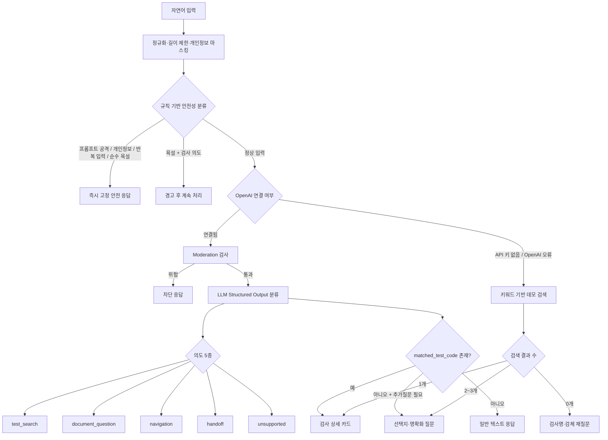
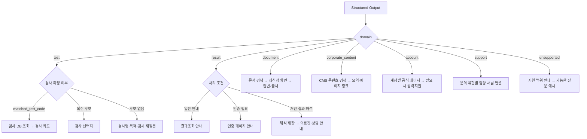
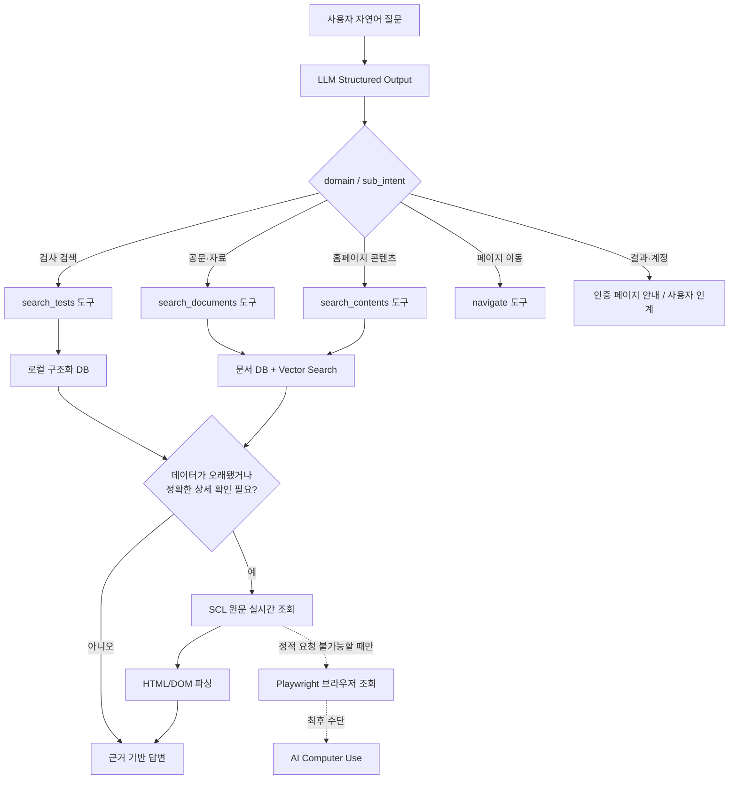
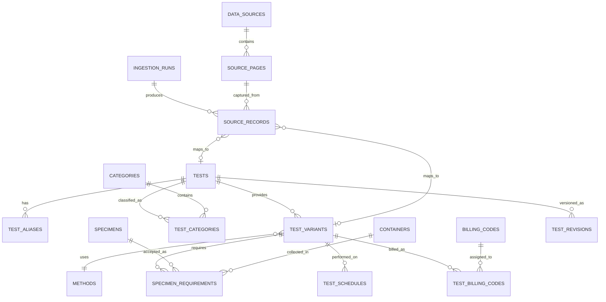
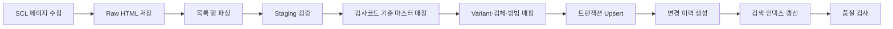
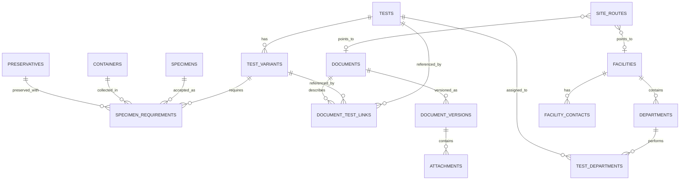
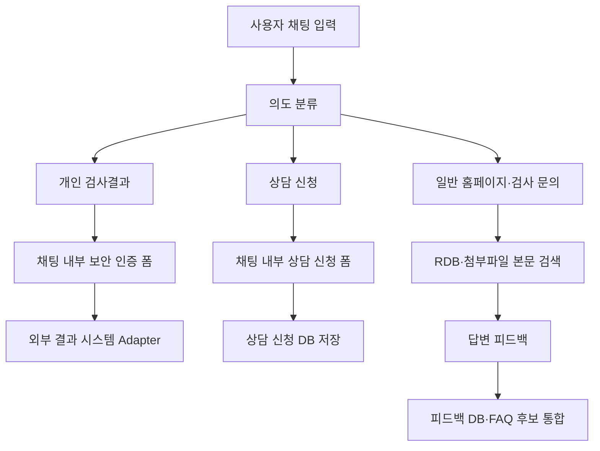

# 자연어 분류 로직과 트리 설계 확인

- 작업 ID: `01a01903-9855-7621-b549-0c46dff78323`
- 시작: 2026-08-19 07:54:40 +00:00
- 마지막 갱신: 08/19/2026 07:54:44
- 메시지 수: 188

> 사용자 메시지와 Codex의 사용자 표시 답변만 내보냈습니다. 시스템/개발자 지침, 추론, 도구 호출 및 도구 출력은 제외했습니다.

## 대화

### 사용자 · 2026-08-19 07:54:40 +00:00

지금 자연어 입력을 분류하는 로직, 그리고 분류 트리가 어케 설계되어있어?

### Codex · 진행 상황 · 2026-08-19 07:54:43 +00:00

현재 코드 기준으로 자연어 분류 진입점부터 분기 조건, 트리 구조까지 추적해볼게요. 관련 파일과 테스트를 먼저 찾아서 실제 동작 순서로 정리하겠습니다.

### Codex · 진행 상황 · 2026-08-19 07:55:12 +00:00

백엔드만 보면 트리는 “안전성 선분기 → OpenAI 구조화 의도 분류 → 카탈로그 매칭/추가질문” 구조입니다. 다만 브라우저 쪽에도 API 실패 시 별도 데모 분기가 있어서, 두 경로가 어떻게 겹치는지도 함께 확인 중입니다.

### Codex · 2026-08-19 07:56:02 +00:00

현재 구조는 하나의 거대한 분류 트리라기보다, **안전성 분류 → 의도 분류 → 검사 매칭 → 응답 형태 결정**의 4단계 라우터로 설계돼 있어요.



### 1. 가장 먼저 안전성 분류

입력은 공백 정리 후 최대 500자로 자르고, 아래 순서대로 검사합니다.

1. 프롬프트 인젝션
2. 개인정보
3. 반복 문자
4. 욕설
5. 정상 입력

분류 카테고리는 다음과 같습니다.

| category | 처리 |
|---|---|
| `prompt_injection` | 즉시 차단 |
| `personal_data` | 주민번호·전화번호·이메일 마스킹 후 안내 종료 |
| `repeated_input` | 차단 |
| `profanity_only` | 차단 |
| `profanity_with_intent` | 경고 문구를 붙이고 정상 분류 계속 |
| `safe` | 정상 처리 |

예를 들어 `씨발 HPV 검사 용기 알려줘`는 욕설만 있는 요청으로 차단하지 않고 `profanity_with_intent`로 처리됩니다. 구현은 [guardrails.py](C:/Users/jonad/documents/project/scl_chat_project/backend/app/guardrails.py:32), 전체 우선순위는 [orchestrator.py](C:/Users/jonad/documents/project/scl_chat_project/backend/app/orchestrator.py:43)에 있습니다.

### 2. OpenAI 의도 분류

API 키가 있으면 정규식으로 의도를 결정하지 않고, 모델이 Structured Output으로 다음 5개 중 하나를 반환합니다.

- `test_search`: 검사명, 검사코드, 검체, 용기, 방법, 소요일 등
- `document_question`: 공문이나 공개 문서 질의
- `navigation`: 홈페이지 메뉴·페이지 안내
- `handoff`: 상담 연결이 필요한 요청
- `unsupported`: 지원 범위 밖 질문

동시에 아래 필드도 추출합니다.

- `matched_test_code`
- `requested_fields`
- `needs_clarification`
- `clarification_question`
- `choices`
- `citations`
- `handoff_recommended`

계약은 [openai_gateway.py](C:/Users/jonad/documents/project/scl_chat_project/backend/app/openai_gateway.py:18), 실제 프롬프트는 같은 파일의 [SYSTEM_INSTRUCTIONS](C:/Users/jonad/documents/project/scl_chat_project/backend/app/openai_gateway.py:30)에 정의돼 있습니다.

모델에는 현재 대화 이력과 5개짜리 데모 검사 카탈로그 전체가 같이 들어갑니다. Vector Store ID가 설정돼 있으면 File Search도 추가됩니다.

### 3. 검사 매칭 및 응답 트리

LLM이 반환한 의도 자체보다 현재는 `matched_test_code`와 `needs_clarification`이 실제 UI 분기를 결정합니다.

- 유효한 `matched_test_code`가 있으면 → 검사 카드
- 매칭은 없고 `needs_clarification=true`이면 → 최대 4개 선택지
- 둘 다 아니면 → 일반 텍스트

즉 `navigation`, `handoff`, `unsupported`별로 별도의 후처리 노드가 구현된 것은 아닙니다. 의도 값은 응답 메타데이터로 내려가지만, 실질적인 출력 분기는 공통입니다. `handoff_recommended`와 `requested_fields`도 아직 후처리에 사용되지 않습니다. 관련 코드는 [orchestrator.py](C:/Users/jonad/documents/project/scl_chat_project/backend/app/orchestrator.py:115)입니다.

### 4. OpenAI가 없을 때의 데모 분류

API 키가 없거나 OpenAI 호출이 실패하면 간단한 키워드 검색으로 내려갑니다.

- `그거`, `그 검사`, `그 항목` + `용기/검체/소요일/방법/언제`
  - 세션의 `last_test_code` 재사용
- 그 외
  - 문장을 토큰화
  - `검사`, `검체`, `알려줘` 같은 불용어 제거
  - 코드·검사명 일치는 3점, 기타 필드 일치는 1점
  - 상위 3개 반환

결과가 1개면 검사 카드, 여러 개면 선택지, 없으면 재질문입니다. 구현은 [catalog.py](C:/Users/jonad/documents/project/scl_chat_project/backend/app/catalog.py:25)와 [orchestrator.py](C:/Users/jonad/documents/project/scl_chat_project/backend/app/orchestrator.py:160)에 있습니다.

### 5. 브라우저 자체 fallback

백엔드 자체가 연결되지 않으면 프런트엔드에 한 단계 더 단순한 분류기가 있습니다.

분기 순서는 다음과 같습니다.

1. 후속 용기 질문
2. HPV
3. 갑상선
4. 빠른 혈액 결과
5. 갑상선 기능·TSH·Free T4
6. 그 외 추가질문

구현은 [demoEngine.js](C:/Users/jonad/documents/project/scl_chat_project/frontend/src/lib/demoEngine.js:12)입니다.

여기에는 현재 작은 설계 문제가 있습니다. `갑상선` 일반 분기가 `갑상선 기능/TSH`보다 먼저라서, `갑상선 기능 검사`는 구체적인 TSH 카드가 아니라 항상 넓은 갑상선 선택지로 빠집니다.

정리하면 현재 핵심 트리는:

> **규칙 기반 안전성 게이트 → LLM 5종 의도 분류 → 코드 매칭/명확화 여부로 UI 분기 → 장애 시 키워드 fallback**

입니다. 다만 `handoff`, `navigation`, `unsupported`를 각각 별도 실행 로직으로 연결하는 작업과 백엔드·브라우저 fallback 규칙을 하나로 통일하는 작업은 아직 남아 있는 상태입니다.

### 사용자 · 2026-08-19 08:48:55 +00:00

일단 다른거 제외하고 llm structured output 분류 아래만 설명해보자 

의도 5종을 나눈 이유, 기준이랑, matched_test_code 존재는 뭐야?

### Codex · 2026-08-19 08:49:44 +00:00

LLM Structured Output 아래에서는 모델이 사용자의 문장을 읽고, 크게 두 가지를 동시에 판단합니다.

1. 이 요청은 어떤 업무인가? → `intent`
2. 특정 검사 항목을 하나로 확정할 수 있는가? → `matched_test_code`

## 의도를 5종으로 나눈 이유

챗봇이 수행해야 하는 다음 행동이 서로 다르기 때문입니다.

| 의도 | 판단 기준 | 이후 기대 행동 |
|---|---|---|
| `test_search` | 특정 검사 또는 검사 조건을 묻는다 | 검사 카탈로그 검색 |
| `document_question` | 공문·공지·정책·일정 등 문서 내용을 묻는다 | 공개 문서/File Search 조회 |
| `navigation` | 홈페이지에서 어디로 가야 하는지 묻는다 | 관련 페이지·메뉴 안내 |
| `handoff` | 인증, 개인정보, 개인 결과, 사람의 판단이 필요하다 | 상담 채널 연결 |
| `unsupported` | SCL 검사·이용 안내 범위를 벗어난다 | 지원 범위 안내 |

### 1. `test_search`

검사 카탈로그의 항목이나 속성을 찾는 요청입니다.

판단 신호:

- 검사명: `HPV 검사 알려줘`
- 검사코드: `DEMO-C5621 찾아줘`
- 조건: `혈액으로 하는 검사`
- 상세 필드: `검체`, `용기`, `검사방법`, `검사일`, `소요일`
- 질환·목적: `갑상선 관련 검사`
- 후속 질문: `그 검사 용기는 뭐야?`

이 의도에서는 `requested_fields`도 함께 추출할 수 있습니다.

```json
{
  "intent": "test_search",
  "requested_fields": ["container", "tat"]
}
```

현재는 `requested_fields`를 응답 후처리에서 적극적으로 사용하지 않고, 모델이 답변을 만들 때 참고하는 구조에 가깝습니다.

### 2. `document_question`

개별 검사 항목이 아니라 공문이나 공개 문서에 있는 내용을 묻는 경우입니다.

예:

- `8월 연휴 검사 일정 변경됐어?`
- `최근 신규검사 공문 알려줘`
- `검사정보 변경 공문 내용 요약해줘`

이 분류가 별도로 있는 이유는 검사 카탈로그가 아니라 Vector Store의 공개 문서를 조회해야 하기 때문입니다.

### 3. `navigation`

정보 자체보다 홈페이지 내 위치나 이용 경로를 묻는 요청입니다.

예:

- `검사결과 조회는 어디서 해?`
- `검사항목 검색 페이지로 가고 싶어`
- `공문 메뉴 어디 있어?`

원래 설계 의도는 답변을 생성하는 것보다 적절한 SCL 페이지 링크를 제공하는 것입니다.

### 4. `handoff`

챗봇이 직접 처리하면 안 되거나, 사람 또는 인증된 시스템이 필요한 요청입니다.

예:

- `내 검사결과 해석해줘`
- `검사결과가 이상한데 어떻게 해야 해?`
- `의뢰 오류를 수정하고 싶어`
- `담당자와 통화하고 싶어`

특히 개인 검사결과 해석, 진단·치료 판단, 본인 확인이 필요한 업무가 여기에 해당합니다.

Structured Output에는 이를 보조하는 `handoff_recommended`도 있습니다.

```json
{
  "intent": "handoff",
  "handoff_recommended": true
}
```

다만 현재 코드에서는 실제 상담 접수 기능까지 연결돼 있지 않고, 이 값도 별도 분기에 사용되지 않습니다.

### 5. `unsupported`

SCL 검사·이용 안내와 무관한 요청을 받기 위한 최종 fallback입니다.

예:

- `오늘 주식 추천해줘`
- `파이썬 코드 작성해줘`
- `서울 맛집 알려줘`

억지로 검사 관련 답변을 생성하지 않고 지원 범위를 설명하기 위해 필요합니다.

---

## `matched_test_code`는 무엇인가

`matched_test_code`는 사용자의 질문이 카탈로그에 있는 특정 검사 하나로 확정됐을 때 모델이 반환하는 식별자입니다.

예를 들어 카탈로그에 다음 항목이 있다고 가정하면:

```json
{
  "code": "DEMO-C5621",
  "name": "HPV DNA Genotyping",
  "aliases": ["HPV", "인유두종바이러스"]
}
```

사용자가 `HPV 검사 용기 알려줘`라고 입력했을 때 모델은 다음처럼 반환합니다.

```json
{
  "intent": "test_search",
  "answer": "HPV DNA Genotyping 검사 정보를 안내합니다.",
  "matched_test_code": "DEMO-C5621",
  "requested_fields": ["container"],
  "needs_clarification": false
}
```

백엔드는 이 코드를 이용해 실제 카탈로그 항목을 다시 조회합니다.

```text
matched_test_code
        ↓
catalog.get("DEMO-C5621")
        ↓
검체·용기·방법·일정·소요일이 담긴 검사 카드
```

중요한 점은 모델이 검사 상세값을 직접 만들어내도록 하지 않는다는 것입니다.

- LLM의 역할: 어떤 검사인지 선택
- 카탈로그의 역할: 검사 상세정보 제공

이렇게 분리해서 검체나 소요일 같은 값을 모델이 추측하는 것을 줄입니다.

## `matched_test_code`가 없는 경우

코드가 없다는 것이 항상 검색 실패라는 뜻은 아닙니다.

### 후보가 여러 개인 경우

`갑상선 검사 알려줘`는 TSH와 Free T4 모두 가능합니다.

```json
{
  "intent": "test_search",
  "matched_test_code": null,
  "needs_clarification": true,
  "clarification_question": "어떤 갑상선 검사를 찾으시나요?",
  "choices": ["TSH", "Free T4"]
}
```

이 경우 UI는 검사 카드 대신 선택지를 보여줍니다.

### 특정 검사가 필요 없는 의도

공문 질문이나 페이지 안내도 `matched_test_code`가 없습니다.

```json
{
  "intent": "navigation",
  "matched_test_code": null,
  "needs_clarification": false
}
```

따라서 정확한 의미는 다음과 같습니다.

> `matched_test_code` 존재 여부는 “특정 검사 하나를 카탈로그에서 확정했는가?”를 나타냅니다.

현재 계약은 [openai_gateway.py](C:/Users/jonad/documents/project/scl_chat_project/backend/app/openai_gateway.py:18), 검사 코드에 따른 응답 분기는 [orchestrator.py](C:/Users/jonad/documents/project/scl_chat_project/backend/app/orchestrator.py:115)에 구현돼 있습니다.

### 사용자 · 2026-08-19 11:11:14 +00:00

의도를 5종으로 나눈 이유
챗봇이 수행해야 하는 다음 행동이 서로 다르기 때문입니다.
의도	판단 기준	이후 기대 행동
test_search	특정 검사 또는 검사 조건을 묻는다	검사 카탈로그 검색
document_question	공문·공지·정책·일정 등 문서 내용을 묻는다	공개 문서/File Search 조회
navigation	홈페이지에서 어디로 가야 하는지 묻는다	관련 페이지·메뉴 안내
handoff	인증, 개인정보, 개인 결과, 사람의 판단이 필요하다	상담 채널 연결
unsupported	SCL 검사·이용 안내 범위를 벗어난다	지원 범위 안내

이 의도 5종이 일단 이 페이지에 있는 모든걸 커버한다 생각해?

### Codex · 2026-08-19 11:11:41 +00:00

아니요. **“검사 안내 챗봇” 범위는 대체로 커버하지만, 현재 홈페이지에 있는 모든 기능과 콘텐츠를 커버한다고 보기는 어렵습니다.**

가장 큰 문제는 현재 5종이 서로 같은 차원의 분류가 아니라는 점이에요.

- `test_search`, `document_question`, `navigation`은 사용자의 목적
- `handoff`는 처리 방법
- `unsupported`는 분류 실패·범위 밖 결과

즉 업무 의도와 처리 상태가 한 목록에 섞여 있습니다.

예를 들어 `내 검사결과가 이상한데 담당자에게 문의하고 싶어`는 다음 세 가지가 동시에 성립합니다.

- 업무 목적: 검사결과 문의
- 처리 조건: 인증 필요
- 최종 행동: 상담 연결

그런데 현재 구조에서는 이걸 전부 `handoff` 하나로 뭉개게 됩니다.

## 현재 페이지에서 빠진 영역

페이지에 보이는 기능을 기준으로 하면 다음 영역이 명확하게 표현되지 않습니다.

| 페이지 영역 | 현재 분류 결과 | 문제점 |
|---|---|---|
| 검사결과 조회·로그인 | `navigation` 또는 `handoff` | 조회 목적과 단순 페이지 안내가 구분되지 않음 |
| 아이디·비밀번호 찾기 | `navigation` 또는 `handoff` | 계정 업무라는 의미가 사라짐 |
| 담당자·고객센터 문의 | `handoff` | 문의 내용이 무엇인지 표현되지 않음 |
| SCL 뉴스 | `document_question` 가능 | 공문·정책 질문과 일반 기업 콘텐츠가 섞임 |
| 건강 레시피 | `document_question` 또는 `unsupported` | 지원 범위가 불명확함 |
| 사업부문·재단 소개 | `navigation` 또는 `document_question` | “내용을 알려줘”와 “페이지로 이동”이 애매함 |
| 원격지원·인트라넷 | `navigation` | 인증·대상 사용자 여부를 표현하지 못함 |

## 추천 구조

의도는 “무엇을 하려는가”로만 나누는 게 좋습니다.

| 추천 의도 | 기준 |
|---|---|
| `test_search` | 검사 항목과 검사정보 조회 |
| `result_service` | 검사결과 조회·해석·인증 관련 요청 |
| `document_search` | 공문·공지·일정·정책 조회 |
| `site_navigation` | 특정 메뉴나 페이지로 이동 |
| `account_service` | 로그인·아이디·비밀번호·인트라넷 |
| `customer_support` | 담당자 문의·오류 접수·원격지원 |
| `general_content` | 뉴스·사업부문·재단·건강 콘텐츠 |
| `unsupported` | SCL 서비스 범위 밖 |

그리고 `handoff`는 의도에서 빼고 별도 플래그로 두는 것이 자연스럽습니다.

```json
{
  "intent": "result_service",
  "needs_handoff": true,
  "requires_authentication": true,
  "needs_clarification": false
}
```

예를 들면:

```text
“검사결과 조회 페이지 어디야?”
intent = result_service
requested_action = navigate
requires_authentication = true
needs_handoff = false
```

```text
“내 검사결과가 왜 높아?”
intent = result_service
requested_action = interpretation
requires_authentication = true
needs_handoff = true
```

```text
“HPV 검사 용기 알려줘”
intent = test_search
requested_action = get_information
matched_test_code = DEMO-C5621
needs_handoff = false
```

## 결론

- 챗봇의 범위를 **검사 검색·공문 질의·메뉴 안내 정도로 한정**한다면 현재 5종도 충분합니다.
- 홈페이지 전체를 이해하고 안내하는 챗봇이라면 부족합니다.
- 특히 `handoff`는 독립적인 의도보다 `needs_handoff` 같은 처리 플래그로 분리하는 게 좋습니다.
- `result_service`, `account_service`, `customer_support` 정도는 별도 의도로 추가해야 페이지의 주요 업무를 제대로 커버할 수 있습니다.

### 사용자 · 2026-08-19 11:15:38 +00:00

홈페이지 전체를 이해하고 안내하는 챗봇으로 생각해보고 

전체 트리형태로 기획한거 보여줘

### Codex · 2026-08-19 11:16:44 +00:00

홈페이지 전체를 이해하는 챗봇이라면, 단순히 `intent` 하나만 고르는 방식보다 **업무 영역 → 세부 목적 → 요청 행동 → 처리 조건** 순서의 트리가 적합합니다.

핵심은 `navigation`과 `handoff`를 최상위 의도에서 빼는 것입니다. 둘 다 사용자의 주제라기보다 “어떻게 처리할지”에 가깝기 때문입니다.

## 전체 의도 분류 트리

```mermaid
flowchart TD
    A["사용자 자연어 입력"] --> B{"1. 업무 영역 domain"}

    B --> T["검사 서비스 test"]
    B --> R["검사결과 result"]
    B --> D["공문·자료 document"]
    B --> C["기관·콘텐츠 corporate_content"]
    B --> AC["계정·접근 account"]
    B --> S["고객지원 support"]
    B --> U["범위 밖 unsupported"]

    T --> T1["검사명·코드 검색"]
    T --> T2["질환·목적 기반 검색"]
    T --> T3["검체·용기 기반 검색"]
    T --> T4["방법·일정·소요일 검색"]
    T --> T5["검사 상세정보 질문"]
    T --> T6["검사 비교"]
    T --> T7["검사 의뢰·준비 안내"]

    R --> R1["결과조회 페이지"]
    R --> R2["결과 예정일·진행 상태"]
    R --> R3["결과지 항목 설명"]
    R --> R4["개인 결과 해석"]
    R --> R5["결과 오류·누락 문의"]
    R --> R6["결과 발급·재발급"]

    D --> D1["검사 일정 공문"]
    D --> D2["신규검사 공문"]
    D --> D3["검사정보 변경 공문"]
    D --> D4["공지사항"]
    D --> D5["문서 검색·요약"]
    D --> D6["최신 문서 비교"]

    C --> C1["SCL 뉴스"]
    C --> C2["검사 Spotlight"]
    C --> C3["건강 레시피"]
    C --> C4["항균제 내성 소식"]
    C --> C5["사업부문 안내"]
    C --> C6["재단·기관 소개"]
    C --> C7["연락처·위치·대표번호"]

    AC --> A1["로그인"]
    AC --> A2["아이디 찾기"]
    AC --> A3["비밀번호 찾기"]
    AC --> A4["인트라넷"]
    AC --> A5["권한·인증 문제"]
    AC --> A6["원격지원"]

    S --> S1["담당자 연결"]
    S --> S2["검사 의뢰 문의"]
    S --> S3["검체·배송 문의"]
    S --> S4["서비스 오류 접수"]
    S --> S5["불만·정정 요청"]
    S --> S6["제휴·사업 문의"]

    U --> U1["SCL과 무관한 일반 질문"]
    U --> U2["지원하지 않는 의료행위"]
    U --> U3["판단 불가능한 입력"]
```



## 1단계: 업무 영역 `domain`

최상위 분류는 다음 7개로 구성합니다.

| domain | 담당 영역 | 대표 데이터·시스템 |
|---|---|---|
| `test` | 검사 검색과 검사정보 | 검사 카탈로그/검사 DB |
| `result` | 검사결과 관련 업무 | 결과조회·인증 시스템 |
| `document` | 공문·공지·일정 | 문서 검색/File Search |
| `corporate_content` | 뉴스·사업·재단·건강 콘텐츠 | 홈페이지 CMS |
| `account` | 로그인·비밀번호·인트라넷 | 계정·인증 페이지 |
| `support` | 담당자 문의·문제 접수 | 상담 채널 |
| `unsupported` | 지원 범위 밖 | 범위 안내 |

이렇게 나누면 각 영역마다 조회해야 하는 데이터와 후속 행동이 달라집니다.

## 2단계: 세부 의도 `sub_intent`

### `test`

```text
test
├─ search_by_name_or_code
├─ search_by_condition
├─ search_by_specimen
├─ search_by_method
├─ search_by_schedule_or_tat
├─ get_test_detail
├─ compare_tests
└─ request_preparation_guide
```

예:

- `HPV 검사 찾아줘` → `search_by_name_or_code`
- `갑상선 관련 검사` → `search_by_condition`
- `소변으로 할 수 있는 검사` → `search_by_specimen`
- `결과 빨리 나오는 혈액 검사` → `search_by_schedule_or_tat`
- `TSH랑 Free T4 차이가 뭐야?` → `compare_tests`

### `result`

```text
result
├─ navigate_to_result
├─ ask_result_timing
├─ explain_report_field
├─ interpret_personal_result
├─ report_result_issue
└─ request_result_document
```

여기서 `결과지 항목의 일반적인 의미 설명`과 `개인의 수치를 해석하는 행위`를 분리해야 합니다.

- `참고치가 뭐야?` → 일반 설명 가능
- `내 TSH가 8인데 갑상선기능저하증이야?` → 개인 결과 해석이므로 의료진 안내

### `document`

```text
document
├─ search_schedule_notice
├─ search_new_test_notice
├─ search_test_change_notice
├─ search_general_notice
├─ summarize_document
└─ compare_document_versions
```

문서 유형을 분리해야 검색 범위를 좁히고, 최신 문서를 우선할 수 있습니다.

### `corporate_content`

```text
corporate_content
├─ search_news
├─ search_test_spotlight
├─ search_health_content
├─ search_resistance_content
├─ explain_business
├─ explain_foundation
└─ get_company_information
```

`공문`과 `뉴스·건강 콘텐츠`는 데이터 성격이 다르므로 분리합니다. 공문은 정확성과 최신성이 중요하고, 일반 콘텐츠는 탐색과 요약이 중심입니다.

### `account`

```text
account
├─ login
├─ recover_id
├─ reset_password
├─ access_intranet
├─ resolve_permission_issue
└─ request_remote_support
```

계정 정보 자체를 챗봇이 처리하기보다는, 정확한 인증 페이지나 원격지원 경로로 보내는 영역입니다.

### `support`

```text
support
├─ connect_agent
├─ test_request_inquiry
├─ specimen_shipping_inquiry
├─ report_service_error
├─ submit_complaint
└─ business_inquiry
```

단순히 `handoff`로 분류하지 않고 “무슨 일로 상담이 필요한지”를 남깁니다. 그래야 담당 부서 라우팅이 가능합니다.

---

## 3단계: 요청 행동 `requested_action`

동일한 업무 영역 안에서도 사용자가 원하는 행동이 다를 수 있습니다.

```text
requested_action
├─ search       검색해줘
├─ explain      설명해줘
├─ summarize    요약해줘
├─ compare      비교해줘
├─ navigate     페이지로 이동시켜줘
├─ download     문서를 받고 싶어
├─ authenticate 로그인·본인인증
└─ contact      담당자에게 연결해줘
```

예를 들어 다음 두 질문은 업무 영역은 같지만 행동이 다릅니다.

```text
“HPV 검사가 뭔지 설명해줘”
domain = test
sub_intent = get_test_detail
requested_action = explain
```

```text
“HPV 검사 페이지로 가줘”
domain = test
sub_intent = get_test_detail
requested_action = navigate
```

그래서 `navigation`을 독립적인 최상위 의도로 두지 않는 편이 좋습니다.

## 4단계: 대상 식별

업무 영역에 따라 식별자가 달라집니다.

| 영역 | 식별 필드 |
|---|---|
| 검사 | `matched_test_code` |
| 공문·문서 | `matched_document_ids` |
| 홈페이지 콘텐츠 | `matched_content_id` |
| 페이지 이동 | `target_route` |
| 담당 부서 | `target_department` |

### `matched_test_code`

특정 검사 하나를 확정했을 때만 들어갑니다.

```json
{
  "domain": "test",
  "sub_intent": "get_test_detail",
  "requested_action": "explain",
  "matched_test_code": "DEMO-C5621"
}
```

후보가 여러 개라면 코드를 억지로 선택하지 않습니다.

```json
{
  "domain": "test",
  "sub_intent": "search_by_condition",
  "matched_test_code": null,
  "candidate_test_codes": [
    "DEMO-D3230",
    "DEMO-D3240"
  ],
  "needs_clarification": true,
  "clarification_question": "TSH와 Free T4 중 어떤 검사를 확인할까요?"
}
```

## 5단계: 처리 조건

최종 응답 전에 별도의 플래그를 판단합니다.

```text
처리 조건
├─ needs_clarification
├─ requires_authentication
├─ needs_handoff
├─ medical_review_required
├─ has_multiple_intents
└─ confidence
```

### `needs_handoff`

이제 `handoff`는 의도가 아니라 처리 플래그입니다.

```json
{
  "domain": "result",
  "sub_intent": "interpret_personal_result",
  "requested_action": "explain",
  "requires_authentication": true,
  "needs_handoff": true,
  "medical_review_required": true
}
```

### `requires_authentication`

검사결과 조회, 결과 발급, 계정 관련 요청에 사용합니다.

```json
{
  "domain": "result",
  "sub_intent": "navigate_to_result",
  "requested_action": "navigate",
  "target_route": "/result",
  "requires_authentication": true,
  "needs_handoff": false
}
```

## 최종 Structured Output 제안

```json
{
  "domain": "test",
  "sub_intent": "get_test_detail",
  "requested_action": "explain",

  "matched_test_code": "DEMO-C5621",
  "candidate_test_codes": [],
  "matched_document_ids": [],
  "matched_content_id": null,
  "target_route": null,
  "target_department": null,

  "requested_fields": [
    "container",
    "tat"
  ],

  "needs_clarification": false,
  "clarification_question": null,
  "choices": [],

  "requires_authentication": false,
  "needs_handoff": false,
  "medical_review_required": false,

  "confidence": 0.96,
  "answer": "HPV 검사의 용기와 소요일을 안내합니다.",
  "citations": []
}
```

## 최종 실행 라우팅



이 구조라면 홈페이지의 검사 조회, 결과조회, 공문, 뉴스, 건강 콘텐츠, 사업부문, 재단, 계정, 원격지원, 고객 문의를 모두 같은 분류 체계 안에서 처리할 수 있습니다. 핵심 모델은 **7개 업무 영역 + 세부 의도 + 행동 + 처리 플래그**입니다.

### 사용자 · 2026-08-19 11:20:57 +00:00

ㅇㅋㅇㅋ 그럼 일단 구현한거 이렇게 수정해줘

### Codex · 진행 상황 · 2026-08-19 11:21:07 +00:00

방금 합의한 구조대로 백엔드의 Structured Output 계약을 `7개 업무 영역 + 세부 의도 + 요청 행동 + 처리 플래그`로 바꾸겠습니다. 기존 검사 카드·명확화 흐름은 유지하고, 결과·계정·지원 요청은 인증/상담 플래그가 실제 응답 분기에 반영되도록 수정한 뒤 테스트까지 확인할게요.

### Codex · 진행 상황 · 2026-08-19 11:22:42 +00:00

핵심 계약 변경과 응답 라우팅까지 적용했고, 현재 백엔드 테스트 12개가 모두 통과했습니다. 이제 코드에 남아 있는 기존 5종 의도 명칭과 문서/응답 계약 불일치를 찾아 정리하겠습니다.

### Codex · 2026-08-19 11:24:23 +00:00

합의한 구조로 수정했습니다.

- 기존 5종 `intent`를 7개 `domain`으로 교체
  - `test`
  - `result`
  - `document`
  - `corporate_content`
  - `account`
  - `support`
  - `unsupported`
- 전체 세부 의도 `sub_intent` 추가
- `requested_action` 8종 추가
- `navigation` → `requested_action="navigate"`
- `handoff` → `needs_handoff=true`
- 인증·의료 검토·복합 의도·신뢰도 필드 추가
- 단일 검사는 `matched_test_code`, 복수 후보는 `candidate_test_codes`로 처리
- 검사 영역이 아닌 경우 모델이 검사 코드를 반환해도 카탈로그와 매칭하지 않도록 방어
- API 응답의 `intent`도 `domain`으로 변경
- 자연어 처리 계약 문서 업데이트

주요 변경 파일:

- [openai_gateway.py](C:/Users/jonad/documents/project/scl_chat_project/backend/app/openai_gateway.py:18)
- [orchestrator.py](C:/Users/jonad/documents/project/scl_chat_project/backend/app/orchestrator.py:121)
- [schemas.py](C:/Users/jonad/documents/project/scl_chat_project/backend/app/schemas.py:43)
- [구현 계획서](C:/Users/jonad/documents/project/scl_chat_project/docs/OpenAI-API-upgrade-plan.md:90)
- [추가 테스트](C:/Users/jonad/documents/project/scl_chat_project/backend/tests/test_structured_routing.py:10)

검증 결과:

- 백엔드: 12개 테스트 통과
- 프런트엔드: 5개 테스트 통과
- Structured Output JSON Schema 생성 확인

현재는 **분류 계약과 서버 라우팅 메타데이터까지 구현된 상태**입니다. 결과조회 시스템, CMS, 계정 인증, 실제 상담 채널은 아직 연결되지 않았으므로 해당 도메인은 모델 답변과 플래그만 반환합니다.

### 사용자 · 2026-08-20 02:08:05 +00:00

이제 다시 고민해 봐야할건데 데이터들을 내가 크롤링해서 db에 저장하는게 맞을까? 아니면 .. 웹 사용해서 ai가 커서로 움직여서 실제 결과를 실시간으로 구하는게 좋을까 

뭐 이게 그냥 이론상 됩니다 보여주는 것 보다 실제 작동하는걸 보여주고싶은데 어떻게 설계하는게 좋을까?

### Codex · 진행 상황 · 2026-08-20 02:08:17 +00:00

실제 데모 기준으로는 “DB 적재”와 “실시간 웹 조작” 중 하나만 고르기보다, 데이터 성격별로 경로를 나누는 게 맞습니다. 현재 SCL 사이트가 검색·결과조회·공문을 어떤 방식으로 제공하는지 확인하고, 브라우저 조작이 필요한 구간과 구조화 적재가 나은 구간을 구분해서 설계안을 제안할게요. OpenAI의 브라우저/컴퓨터 사용 방식도 관련돼 있어 공식 지침 기준으로 확인하겠습니다.

### Codex · 2026-08-20 02:09:55 +00:00

결론부터 말하면 **“크롤링 DB + 필요 시 원문 실시간 검증” 하이브리드 구조**가 가장 좋습니다.

AI가 매 질문마다 마우스로 웹사이트를 조작해서 결과를 가져오는 방식은 시연 효과는 있지만, 핵심 조회 엔진으로 쓰기에는 느리고 불안정합니다. 실제로 작동한다는 인상을 주려면 “커서가 움직이는 모습”보다 **현재 SCL 데이터가 검색되고, 출처와 확인 시각이 표시되는 것**이 더 중요합니다.

현재 SCL 검사항목 페이지는 검사코드·검사명·방법·검체·보험코드·검사일·소요일을 표 형태로 공개하고 있으며 약 3,300개 항목이 확인됩니다. 따라서 이 영역은 안정적으로 수집·구조화하기 적합합니다. [SCL 검사항목조회](https://www.scllab.co.kr/front/check/check_item_list.do?pageIndex=10)

## 추천 전체 구조



## 데이터별 처리 방식

| 데이터 | 권장 방식 | 이유 |
|---|---|---|
| 검사항목 3,300여 개 | DB에 정기 수집 | 구조화 검색·비교·필터링에 적합 |
| 검사 상세정보 | DB 캐시 + 원문 실시간 검증 | 정확성과 속도 동시 확보 |
| 검체용기 | DB에 정기 수집 | 용기별 속성이 구조화돼 있음 |
| 공문·공지 | 메타데이터 DB + 원문/PDF 저장 | 최신성·버전 관리 필요 |
| 뉴스·건강 콘텐츠 | 정기 수집 + 벡터 검색 | 자연어 요약에 적합 |
| 사업부문·재단·연락처 | 사이트맵 DB | 변경 빈도가 낮음 |
| 결과조회·로그인 | 크롤링하지 않음 | 개인정보와 인증이 포함됨 |
| 아이디·비밀번호 찾기 | 공식 페이지 이동 | 사용자 직접 조작 영역 |
| 원격지원·상담 | 링크 또는 상담 연결 | 외부 행동이므로 명시적 인계 |

SCL 홈페이지에는 실제로 항목조회, 결과조회 로그인, 공문, 뉴스가 각각 별도 기능으로 노출돼 있습니다. [SCL 홈페이지](https://www.scllab.co.kr/?lang=en)

## 1. 검사 데이터는 DB에 저장

검사정보는 관계형 DB가 중심이어야 합니다.

```text
tests
├─ source_id
├─ test_code
├─ test_name
├─ method
├─ specimen
├─ insurance_code
├─ schedule
├─ turnaround_time
├─ source_url
├─ source_updated_at
├─ crawled_at
├─ content_hash
└─ is_active
```

동일 검사코드에 검체만 다른 항목이 있을 수 있으므로 실제로는 다음처럼 분리하는 게 안전합니다.

```text
tests
└─ test_variants
   ├─ specimen
   ├─ container
   ├─ schedule
   └─ turnaround_time
```

검색은 SQL의 전문검색과 유사어 검색을 먼저 사용합니다.

- 검사코드 완전 일치
- 검사명·영문명·약어
- 질환·목적
- 검체
- 방법
- 소요일

임베딩은 사용자의 표현을 검사 후보로 연결하는 용도로만 사용하고, 검사방법이나 소요일의 사실값은 반드시 DB에서 가져옵니다.

## 2. 실시간 조회는 “검증 레이어”

질문마다 사이트 전체를 새로 크롤링하지 않습니다.

예를 들어:

```text
사용자: HPV 검사 용기와 소요일 알려줘
```

처리 과정:

1. 로컬 DB에서 HPV 후보 검색
2. 특정 검사코드 확정
3. 해당 레코드의 `crawled_at` 확인
4. 최신성 기준을 넘겼다면 SCL 원문 한 페이지만 조회
5. 값이 변경됐다면 DB 갱신
6. 최신값과 출처를 답변

답변 UI에는 다음처럼 표시합니다.

```text
HPV DNA Genotyping
검체/용기: …
검사일: …
소요일: …

출처: SCL 검사항목조회
실시간 확인: 2026-08-20 14:32
```

이게 “실제로 작동한다”는 가장 강한 증거입니다.

## 3. 수집 주기

추천 기준은 다음과 같습니다.

- 검사항목 목록: 하루 1회
- 공문 목록: 30분~1시간 간격
- 뉴스·기관 콘텐츠: 하루 1회
- 사용자가 선택한 검사 상세: 답변 시 실시간 확인
- 크롤링 실패 시: 마지막 정상 데이터 사용 + 오래된 데이터임을 표시

각 페이지의 HTML을 해시로 저장해 변경 여부를 탐지하면 됩니다.

```text
신규 항목 → INSERT
내용 변경 → 새 버전 저장
사이트에서 사라짐 → is_active=false
파싱 실패 → 기존 데이터 유지 + 운영 경고
```

## 4. 마우스를 움직이는 AI는 어디에 쓸까

AI Computer Use는 다음 상황에만 제한적으로 쓰는 것이 좋습니다.

- 정적 HTTP 요청으로 데이터를 못 가져오는 페이지
- JavaScript를 실행해야 결과가 나오는 검색 폼
- 페이지 구조가 수시로 달라져 일반 선택자로 처리하기 어려운 탐색
- 시연 중 “해당 원문 페이지 열기” 같은 시각적 동작

반대로 검사항목 3,000개 검색처럼 반복적이고 구조화된 작업에는 적합하지 않습니다.

- 속도가 느림
- 화면 변경에 취약
- 호출 비용이 큼
- 같은 질문에도 행동이 달라질 수 있음
- 웹페이지 안의 악성 문구를 지시로 오인할 위험
- 로그인·개인정보 입력 시 보안 부담이 큼

OpenAI 공식 문서도 반복·조건·DOM 검사가 필요한 작업에는 Playwright 같은 코드 기반 브라우저 환경이 더 적합할 수 있다고 설명하며, Computer Use는 격리 환경·도메인 허용목록·고위험 작업의 사용자 확인을 권장합니다. [OpenAI Computer Use 가이드](https://developers.openai.com/api/docs/guides/tools-computer-use)

우선순위는 이렇게 잡으면 됩니다.

```text
공식 API
→ 직접 HTTP 요청 + HTML 파싱
→ Playwright의 고정 선택자 자동화
→ AI Computer Use
```

## 실제 데모에 적합한 구현안

제가 이 프로젝트라면 첫 번째 실제 버전을 다음 범위로 만듭니다.

1. SCL 검사항목 목록을 실제로 수집해 PostgreSQL 또는 SQLite에 저장
2. 검사코드·명칭·검체·방법·소요일 검색 구현
3. 선택된 검사만 원문에서 실시간 재확인
4. 공문 목록과 PDF를 수집해 문서 검색 연결
5. 모든 답변에 원문 URL·수집 시각·실시간 확인 여부 표시
6. 결과조회·계정 업무는 공식 페이지를 열어주고 사용자에게 인계
7. AI 커서 조작은 “원문에서 이 검사를 직접 확인해 보기” 시연 기능으로만 추가

즉 핵심 메시지는:

> 챗봇의 답변은 DB 때문에 빠르고, 원문 실시간 검증 때문에 최신이며, 브라우저 에이전트 때문에 필요한 경우 실제 사이트 행동까지 가능하다.

이 구성이 데모 안정성과 실제 제품 가능성을 모두 가장 잘 보여줍니다. 크롤링 전에는 SCL 사이트의 이용조건·robots 정책과 허용 범위를 확인하고, 낮은 호출 빈도와 캐싱을 적용해야 합니다.

### 사용자 · 2026-08-20 02:12:36 +00:00

검사항목같이 검색&조회해야하는것들 말고는 그냥 링크처리 or db 구현 뭐가 좋을까 

솔직히 귀찮더라도 한번 db에 다 저장하는게 좋지 않나?

### Codex · 2026-08-20 02:13:09 +00:00

응. **홈페이지 전체를 이해하는 챗봇이 목표라면, 공개 콘텐츠는 한 번 DB에 저장하는 쪽이 맞습니다.** 단, 모든 데이터를 동일한 구조로 정규화할 필요는 없어요.

핵심은 이겁니다.

> DB는 “내용을 이해하고 답변하기 위해”, 링크는 “사용자가 실제 행동을 완료하기 위해” 사용한다.

## 추천 구분

| 데이터 | 저장 방식 | 사용자 응답 |
|---|---|---|
| 검사항목 | 완전 구조화 DB | 검색·비교·상세 카드 |
| 검체용기 | 구조화 DB | 용기 상세 안내 |
| 공문·공지 | 메타데이터 + 본문 저장 | 내용 답변 + 원문 링크 |
| PDF·의뢰서 | 파일 메타데이터 + 추출 텍스트 | 요약 + 다운로드 링크 |
| 뉴스·건강 콘텐츠 | 본문 저장 | 요약 + 원문 링크 |
| 사업부문·재단 소개 | 본문 저장 | 설명 + 상세 페이지 링크 |
| 메뉴·페이지 위치 | 사이트맵 DB | 바로가기 링크 |
| 결과조회 | URL만 저장 | 로그인 페이지 이동 |
| 아이디·비밀번호 찾기 | URL만 저장 | 공식 페이지 이동 |
| 인트라넷·원격지원 | URL만 저장 | 외부 페이지 이동 |
| 개인 검사결과 | 저장하지 않음 | 인증 시스템/상담 연결 |

## 모든 페이지를 저장할 때의 DB 구조

검사항목처럼 중요한 데이터만 별도 테이블로 만들고, 나머지는 범용 콘텐츠 테이블 하나로 처리하면 덜 귀찮습니다.

### 검사항목

```text
tests
test_variants
test_aliases
```

### 홈페이지 콘텐츠 전체

```text
content_documents
├─ id
├─ content_type
│  ├─ notice
│  ├─ news
│  ├─ health_content
│  ├─ business
│  ├─ foundation
│  ├─ guide
│  └─ form
├─ title
├─ body_text
├─ summary
├─ published_at
├─ source_url
├─ attachment_url
├─ crawled_at
├─ last_seen_at
├─ content_hash
└─ is_active
```

### 링크와 메뉴

```text
site_routes
├─ id
├─ name
├─ aliases
├─ description
├─ url
├─ requires_authentication
├─ external
└─ enabled
```

예:

```json
{
  "name": "검사결과 조회",
  "aliases": ["결과조회", "검사 결과", "결과 확인"],
  "description": "아이디와 비밀번호로 검사결과를 조회하는 페이지",
  "url": "https://www.scllab.co.kr/...",
  "requires_authentication": true,
  "external": false
}
```

## 링크만 저장하면 부족한 이유

링크만 알고 있으면 이런 질문은 처리할 수 있습니다.

```text
“재단 소개 페이지 어디야?”
→ 재단 소개 링크 제공
```

하지만 다음 질문은 답하기 어렵습니다.

```text
“SCL 재단이 무슨 일을 해?”
“최근 검사 일정 변경 공문이 뭐야?”
“원격지원은 언제 이용하는 거야?”
```

이 질문에 답하려면 페이지 본문이 DB나 검색 인덱스에 있어야 합니다.

반대로 본문만 저장하고 링크를 안 주면 사용자가 실제 업무를 완료할 수 없습니다. 따라서 **본문 저장과 링크 제공을 같이 해야 합니다.**

## “한 번 다 저장”의 주의점

정확히는 한 번 저장하고 끝내는 게 아니라:

```text
최초 전체 수집
→ 주기적 목록 확인
→ content_hash 비교
→ 변경된 페이지만 갱신
→ 사라진 페이지는 is_active=false
```

이 구조가 되어야 합니다.

처음에는 전부 가져오더라도 이후에는 변경분만 업데이트하면 되므로 운영 부담이 크지 않습니다.

추천 주기:

- 검사항목: 하루 1회
- 검체용기·이용안내: 하루 1회
- 공문·공지: 30분~1시간
- 뉴스·건강 콘텐츠: 하루 1회
- 사업부문·재단 등 정적 페이지: 일주일 1회
- 결과조회·인증 URL: 일주일 1회 정상 동작 확인

## RAG와 DB의 역할

모든 데이터를 Vector Store에만 넣는 것은 추천하지 않습니다.

```text
검사코드·검체·소요일
→ SQL/구조화 검색

공문·뉴스·소개 페이지 본문
→ 전문검색 + Vector Search

페이지 위치·로그인·원격지원
→ site_routes 조회
```

LLM은 직접 웹을 뒤지는 대신 적절한 도구를 선택합니다.

```text
search_tests()
search_documents()
search_contents()
find_route()
get_live_source()
```

## 최종 추천

공개된 홈페이지 데이터는 가능한 범위에서 전부 저장하는 게 좋습니다. 다만 다음처럼 나눕니다.

- 검사항목·용기 → 정규화된 전용 테이블
- 공문·뉴스·일반 페이지 → 범용 콘텐츠 테이블
- 페이지 이동·로그인·원격지원 → 사이트맵 테이블
- PDF → 메타데이터와 추출 텍스트
- 개인 결과·계정정보 → 절대 저장하지 않고 공식 링크로 이동

그리고 챗봇 응답은 항상:

```text
DB에서 내용을 찾아 답변
+
사용자가 확인하거나 업무를 수행할 수 있는 원문 링크 제공
```

이 방식이 맞습니다. 크롤러를 한 번 제대로 만들어두면 이후 의도 분류와 답변 품질도 훨씬 안정적으로 가져갈 수 있어요.

### 사용자 · 2026-08-20 02:14:48 +00:00

그럼 일단 rdb에 넣을 수 ㅇ있는 검사 항목들, 정규화 되어있는 데이터들 저장하는 계획부터 세워보자 

table, 관계 등등 생각해서 계획 세워봐

### Codex · 2026-08-20 02:16:20 +00:00

좋아. 먼저 범위를 **검사항목처럼 행과 열로 정규화할 수 있는 공개 데이터**로 한정하고, PostgreSQL 기준으로 설계하는 게 좋겠습니다.

SCL 목록을 보면 동일 검사코드가 검체별로 여러 행에 나타날 수 있습니다. 예를 들어 `45140`은 `Rectal swab`, `Other` 검체로 나뉩니다. 따라서 `검사코드 = DB 한 행`으로 단순 저장하면 안 되고, **검사 마스터와 검사 변형(variant)을 분리**해야 합니다. [SCL 검사항목조회](https://www.scllab.co.kr/front/check/check_item_list.do?pageIndex=10)

## 1. 저장 대상

1차 구축 범위는 다음으로 잡습니다.

- 검사코드
- 검사명
- 검사 별칭·영문명
- 검사방법
- 검체
- 검체용기
- 보험·비보험 코드
- 검사 실시 요일·시간대
- 소요일
- 검사 분야
- 담당 팀
- 질환별 분류
- 검체 채취량·보관법·주의사항
- 원문 출처
- 수집·변경 이력

## 2. 전체 관계



## 3. 핵심 테이블

### `tests`: 검사 마스터

검사의 정체성을 나타냅니다. 검사코드 기준으로 한 행을 만듭니다.

| 컬럼 | 타입 | 설명 |
|---|---|---|
| `id` | bigint PK | 내부 식별자 |
| `data_source_id` | bigint FK | SCL 등 출처 |
| `source_test_code` | varchar | 원본 검사코드 |
| `name_ko` | varchar | 한글·대표 검사명 |
| `name_en` | varchar nullable | 영문명 |
| `normalized_name` | varchar | 검색용 정규화 명칭 |
| `description` | text nullable | 검사 설명 |
| `status` | enum | active/inactive/unknown |
| `first_seen_at` | timestamptz | 최초 발견 |
| `last_seen_at` | timestamptz | 마지막 확인 |
| `created_at` | timestamptz | 생성 시각 |
| `updated_at` | timestamptz | 수정 시각 |

제약조건:

```sql
UNIQUE (data_source_id, source_test_code)
```

검사코드가 없는 데이터까지 고려한다면 별도 `source_external_key`를 허용합니다.

### `test_aliases`: 별칭·약어

```text
HPV DNA Genotyping
├─ HPV
├─ HPV genotyping
├─ 인유두종바이러스
└─ HPV 유전자형
```

| 컬럼 | 설명 |
|---|---|
| `id` | PK |
| `test_id` | 검사 FK |
| `alias` | 원본 별칭 |
| `normalized_alias` | 검색용 값 |
| `alias_type` | abbreviation/english/korean/synonym |
| `source` | crawl/manual/generated |
| `verified` | 검증 여부 |

LLM이 생성한 별칭과 원문에서 가져온 별칭을 구분해야 합니다. LLM 생성 별칭은 기본적으로 `verified=false`로 둡니다.

### `test_variants`: 검사 변형

같은 검사코드라도 방법, 검체 조건, 검사 일정이 다를 수 있으므로 분리합니다.

| 컬럼 | 설명 |
|---|---|
| `id` | PK |
| `test_id` | 검사 마스터 FK |
| `method_id` | 검사방법 FK |
| `variant_name` | 변형 표시명 |
| `tat_text` | 원문의 소요일 |
| `tat_min_days` | 최소 소요일 |
| `tat_max_days` | 최대 소요일 |
| `tat_basis` | 검사 후/접수 후 등 |
| `source_row_key` | 원본 행 식별값 |
| `status` | active/inactive |
| `last_seen_at` | 마지막 확인 |

`tat_text`와 숫자 필드를 같이 저장하는 것이 중요합니다.

```text
원문: 검사 후 1–2일
tat_min_days: 1
tat_max_days: 2
tat_basis: after_test
```

파싱이 잘못돼도 원문을 잃지 않습니다.

## 4. 검체와 용기

### `specimens`

| 컬럼 | 설명 |
|---|---|
| `id` | PK |
| `canonical_name` | 표준 검체명 |
| `normalized_name` | 정규화 값 |
| `specimen_group` | blood/serum/urine/tissue/swab 등 |
| `description` | 설명 |

예:

```text
EDTA W/B
Whole Blood
전혈
EDTA 전혈
```

처음부터 모두 하나로 합치지 말고 원본명을 보존하면서 표준 검체에 매핑합니다.

필요하면 다음 테이블을 추가합니다.

```text
specimen_aliases
├─ specimen_id
├─ alias
└─ normalized_alias
```

### `containers`

| 컬럼 | 설명 |
|---|---|
| `id` | PK |
| `name` | 용기명 |
| `normalized_name` | 검색용 명칭 |
| `additive` | 첨가제 |
| `default_storage` | 기본 보관조건 |
| `description` | 설명 |
| `image_url` | 공식 이미지 |
| `source_url` | 원문 URL |

### `specimen_requirements`

검사 변형과 검체·용기를 연결합니다.

| 컬럼 | 설명 |
|---|---|
| `id` | PK |
| `test_variant_id` | 검사 변형 FK |
| `specimen_id` | 검체 FK |
| `container_id` | 용기 FK, nullable |
| `is_primary` | 기본 검체 여부 |
| `minimum_volume` | 최소 채취량 |
| `recommended_volume` | 권장 채취량 |
| `volume_unit` | mL 등 |
| `storage_condition` | 실온/냉장/냉동 |
| `handling_note` | 처리방법 |
| `rejection_note` | 부적합 조건 |
| `raw_text` | 원문 전체 |

이 테이블을 두면 다음 질문을 SQL로 처리할 수 있습니다.

- `소변 검체로 가능한 검사`
- `EDTA tube를 사용하는 검사`
- `냉장 보관이 필요한 HPV 검사`
- `최소 3mL가 필요한 검사`

## 5. 검사방법

### `methods`

| 컬럼 | 설명 |
|---|---|
| `id` | PK |
| `name` | 대표 방법명 |
| `normalized_name` | 정규화 값 |
| `method_group` | PCR/NGS/CLIA/Culture 등 |
| `description` | 설명 |

필요하면 `method_aliases`를 둡니다.

```text
Real-time PCR
RT-PCR
Realtime PCR
실시간 중합효소연쇄반응
```

## 6. 검사 일정

### `test_schedules`

검사 일정은 문자열 하나로만 저장하면 조건 검색이 어렵습니다.

| 컬럼 | 설명 |
|---|---|
| `id` | PK |
| `test_variant_id` | 검사 변형 FK |
| `day_of_week` | 1~7 |
| `shift` | day/night/any |
| `frequency_text` | 원문 |
| `cutoff_time` | 접수 마감 시각 |
| `note` | 특이사항 |

예:

```text
원문: 월~토 / 주간

월요일 day
화요일 day
수요일 day
목요일 day
금요일 day
토요일 day
```

다만 초기에 파싱이 어려우면 `frequency_text`만 채우고, 구조화 컬럼은 점진적으로 보강해도 됩니다.

## 7. 보험·비보험 코드

하나의 검사에 코드가 복수이거나 변경될 가능성을 고려합니다.

### `billing_codes`

| 컬럼 | 설명 |
|---|---|
| `id` | PK |
| `code_system` | HIRA/insurance/non-benefit 등 |
| `code` | 코드 |
| `description` | 설명 |

### `test_billing_codes`

| 컬럼 | 설명 |
|---|---|
| `test_variant_id` | 검사 변형 FK |
| `billing_code_id` | 수가 코드 FK |
| `valid_from` | 적용 시작일 |
| `valid_to` | 적용 종료일 |
| `is_primary` | 대표 코드 여부 |
| `source_url` | 근거 |

복합 PK 또는 Unique:

```sql
UNIQUE (test_variant_id, billing_code_id, valid_from)
```

## 8. 검사 분야·팀·질환 분류

하나의 범용 계층 테이블로 처리합니다.

### `categories`

| 컬럼 | 설명 |
|---|---|
| `id` | PK |
| `category_type` | field/team/disease/set |
| `name` | 분류명 |
| `parent_id` | 상위 분류 FK |
| `source_external_key` | 원본 값 |

### `test_categories`

```text
test_id
category_id
is_primary
```

이 구조면 다음처럼 확장할 수 있습니다.

```text
검사 분야
├─ 진단혈액
├─ 임상화학
└─ 분자진단

질환
├─ 감염질환
│  ├─ 호흡기 감염
│  └─ 성매개 감염
└─ 내분비질환
   └─ 갑상선
```

## 9. 출처와 수집 이력

이 부분은 반드시 처음부터 넣어야 합니다.

### `data_sources`

```text
id
name
base_url
source_type
enabled
```

### `source_pages`

```text
id
data_source_id
page_type
url
title
last_fetched_at
last_success_at
content_hash
http_status
```

### `ingestion_runs`

```text
id
started_at
finished_at
status
pages_requested
pages_succeeded
records_found
records_inserted
records_updated
records_deactivated
error_summary
```

### `source_records`

파싱 전후의 원본 행을 보존합니다.

```text
id
ingestion_run_id
source_page_id
external_key
content_hash
raw_payload JSONB
test_id nullable
test_variant_id nullable
first_seen_at
last_seen_at
is_current
```

크롤러 파싱 버그가 생겼을 때 원문 데이터를 가지고 다시 변환할 수 있습니다.

## 10. 변경 이력

현재값만 덮어쓰면 “어제와 무엇이 달라졌는지” 알 수 없습니다.

### `test_revisions`

```text
id
test_id
revision_number
snapshot JSONB
changed_fields JSONB
source_record_id
valid_from
valid_to
created_at
```

예:

```json
{
  "changed_fields": {
    "tat_text": {
      "before": "검사 후 3일",
      "after": "검사 후 2일"
    },
    "schedule": {
      "before": "월~금",
      "after": "월~토"
    }
  }
}
```

운영 테이블은 최신 상태를 제공하고, revision은 변경 추적과 감사에 사용합니다.

## 11. 삭제 정책

크롤링 결과에서 사라졌다고 바로 DB에서 삭제하면 안 됩니다.

```text
첫 미발견
→ 상태 유지

연속 2~3회 미발견
→ status=inactive_candidate

추가 확인 후
→ status=inactive
```

물리 삭제는 하지 않습니다. 오래된 검사 링크나 대화 기록이 기존 코드에 의존할 수 있기 때문입니다.

## 12. 검색 인덱스

PostgreSQL 기준으로 다음을 권장합니다.

```sql
UNIQUE INDEX tests_source_code
    ON tests(data_source_id, source_test_code);

INDEX tests_normalized_name
    ON tests(normalized_name);

GIN INDEX tests_name_trgm
    ON tests USING gin(normalized_name gin_trgm_ops);

GIN INDEX test_aliases_trgm
    ON test_aliases USING gin(normalized_alias gin_trgm_ops);

INDEX variants_tat
    ON test_variants(tat_min_days, tat_max_days);

INDEX specimens_group
    ON specimens(specimen_group);

INDEX source_records_hash
    ON source_records(external_key, content_hash);
```

한국어 검색 때문에 PostgreSQL `pg_trgm`을 먼저 적용하고, 이후 필요하면 임베딩 검색을 추가합니다.

## 13. 수집 파이프라인



중요한 원칙:

- 수집과 운영 DB 반영을 분리
- 파싱 결과를 staging에서 먼저 검증
- 전체 수집이 성공한 경우에만 활성 상태 변경
- 일부 페이지 실패 시 기존 데이터 유지
- 원문 텍스트와 구조화 값을 함께 저장

## 14. 구축 순서

### 1단계: 데이터 프로파일링

- 검사 목록 10~20페이지 표본 수집
- 동일 검사코드 중복 유형 확인
- 검사코드 없는 항목 확인
- 상세 페이지 URL 규칙 확인
- 소요일·일정 표현 패턴 수집
- 검체와 검사방법 표기 변형 확인

### 2단계: 최소 스키마

먼저 다음 테이블만 구축합니다.

```text
data_sources
source_pages
ingestion_runs
source_records
tests
test_variants
methods
specimens
```

### 3단계: 목록 전체 적재

- 전체 페이지 순회
- 검사코드별 마스터 생성
- 검체·방법 차이는 variant로 생성
- 원본 행 JSONB 보관
- 중복 및 누락 리포트 생성

### 4단계: 상세정보 확장

```text
containers
specimen_requirements
test_schedules
billing_codes
test_billing_codes
```

### 5단계: 분류와 검색

```text
test_aliases
categories
test_categories
pg_trgm 인덱스
```

### 6단계: 변경 감지

```text
test_revisions
미발견 항목 비활성화
수집 실행 통계
파싱 오류 알림
```

## 15. 1차 완료 기준

- 전체 공개 검사항목이 DB에 적재된다.
- 동일 검사코드의 서로 다른 검체가 유실되지 않는다.
- 검사코드·검사명·검체·방법·소요일로 검색할 수 있다.
- 모든 결과에서 원문 URL과 마지막 확인 시각을 찾을 수 있다.
- 재수집해도 중복 행이 생기지 않는다.
- 변경된 검사일·소요일을 추적할 수 있다.
- 수집 일부가 실패해도 기존 정상 데이터가 사라지지 않는다.
- DB 데이터만으로 검사 카드 응답을 생성할 수 있다.

첫 구현은 **8개 최소 테이블로 전체 목록 적재를 성공시키고**, 이후 용기·일정·보험코드·버전 관리를 붙이는 순서가 가장 안전합니다.

### 사용자 · 2026-08-20 02:21:55 +00:00

ㅇㅋ 그럼 1차 완료 기준에 도달할때까지 구현 진행해

### Codex · 진행 상황 · 2026-08-20 02:22:05 +00:00

1차 완료 기준까지 실제로 구현하겠습니다. 우선 현재 백엔드 구조와 의존성, SCL 목록 페이지의 실제 요청 파라미터·행 식별 방식을 확인한 뒤, RDB 스키마 → 수집기 → 검색 API/챗봇 연결 → 전체 적재 및 재수집 안정성 테스트 순서로 진행할게요. 공개 사이트에는 낮은 요청 빈도와 캐시를 적용하고, 원문·수집 시각·변경 이력을 함께 보존하겠습니다.

### Codex · 진행 상황 · 2026-08-20 02:23:32 +00:00

확인 결과 공개 목록은 `robots.txt`에서 전체 허용되고, 한 페이지당 50건 요청이 가능해 전체 약 67페이지로 수집할 수 있습니다. 또한 동일 검사코드가 검체별로 여러 행을 가지므로 `tests`와 `test_variants`를 반드시 분리하고, 원본의 `itemcode + sampcode`를 변형 식별자로 보존하겠습니다. 브라우저 자동화 없이 일반 HTTP/HTML 파싱으로 안정적으로 처리할 수 있습니다.

### Codex · 진행 상황 · 2026-08-20 02:28:20 +00:00

RDB 스키마와 수집 파이프라인의 첫 실행이 완료됐고, 실제 공개 페이지 2개/100행을 시험 적재했습니다. 다음으로 기존 JSON 데모 카탈로그를 RDB 저장소로 교체하면서, 같은 검사코드의 복수 검체를 구분할 수 있도록 `variant_key`까지 챗봇 계약에 연결하겠습니다.

### Codex · 진행 상황 · 2026-08-20 02:33:15 +00:00

수집기 단위·통합 테스트까지 추가했고, 동일 코드/복수 검체 보존, 재수집 중복 방지, 값 변경 시 revision 생성, 부분 수집 실패 시 기존 데이터 유지가 모두 통과했습니다. 이제 실제 67페이지 전체를 적재하고 건수·중복·검색·재수집 결과를 검증하겠습니다.

### Codex · 진행 상황 · 2026-08-20 02:37:05 +00:00

전체 3,327행을 실제 DB에 적재했고, 검사 마스터 2,596개와 검체별 변형 3,327개로 분리됐습니다. 두 번째 전체 동기화에서는 신규 0·변경 0·동일 3,327로 확인되어 중복 없이 재실행됩니다. 이제 무결성 검사와 전체 테스트/빌드, API 동작을 최종 확인하겠습니다.

### Codex · 2026-08-20 02:39:18 +00:00

1차 완료 기준까지 구현 완료했습니다.

### 실제 적재 결과

- SCL 공개 목록 전체 67페이지 수집
- 원본 행: 3,327개
- 검사 마스터: 2,596개
- 검체별 검사 변형: 3,327개
- 검사방법: 200개
- 검체 종류: 112개
- 급여·비급여 코드: 1,111개
- 모든 항목에 원문 상세 URL 저장

DB는 [scl_catalog.db](C:/Users/jonad/documents/project/scl_chat_project/data/scl_catalog.db)에 생성됐습니다.

### 구현 내용

- `tests`와 `test_variants` 분리
- 동일 검사코드의 복수 검체 보존
- 검사명·코드·검체·방법·소요일 검색
- 원본 행 JSON과 콘텐츠 해시 보존
- 변경 시 `test_revisions` 생성
- 연속 3회 미발견 시에만 비활성화
- 부분 수집·페이지 실패 시 기존 데이터 유지
- SQLite 기본, `DATABASE_URL`로 PostgreSQL 지원
- 챗봇의 기존 JSON 카탈로그를 RDB 검색으로 교체
- LLM 후보를 전체 3천 건 대신 RDB 검색 상위 10건으로 제한
- 동일 코드에 변형이 여러 개면 `variant_key`로 구분

주요 코드:

- [RDB 모델](C:/Users/jonad/documents/project/scl_chat_project/backend/app/models.py:28)
- [전체 수집기](C:/Users/jonad/documents/project/scl_chat_project/backend/app/scl_crawler.py:163)
- [RDB 검색 저장소](C:/Users/jonad/documents/project/scl_chat_project/backend/app/catalog.py:52)
- [스키마 문서](C:/Users/jonad/documents/project/scl_chat_project/docs/test-catalog-rdb.md:1)
- [수집 테스트](C:/Users/jonad/documents/project/scl_chat_project/backend/tests/test_crawler.py:51)

### API

- `GET /api/catalog/status`
- `GET /api/tests/search?q=HPV`
- `GET /api/tests/{code}`
- `GET /api/tests/{code}?variant_key=45140:774`

같은 검사코드에 검체별 항목이 여러 개면 단일 항목으로 임의 선택하지 않고 `409`와 후보 목록을 반환합니다.

### 재수집 검증

두 번째 전체 수집 결과:

```text
신규: 0
변경: 0
동일: 3,327
중복: 0
```

무결성 검사:

```text
SQLite integrity: ok
외래키 위반: 0
중복 variant_key: 0
필수값 누락: 0
현재 원본 레코드: 3,327
```

검증도 모두 통과했습니다.

- 백엔드: 15개 테스트 통과
- 프런트엔드: 9개 테스트 통과
- 프런트엔드 프로덕션 빌드 통과
- Docker Compose 설정 검증 통과

갱신 명령은 다음과 같습니다.

```powershell
$env:PYTHONPATH="backend"
.venv\Scripts\python scripts\crawl_scl_tests.py
```

현재 데이터는 내부 공식 DB가 아니라 [SCL 공개 검사항목조회](https://www.scllab.co.kr/front/check/check_item_list.do)를 동기화한 스냅샷이며, 챗봇 응답에는 실제 원문 상세 링크가 함께 표시됩니다.

### 사용자 · 2026-08-20 02:45:17 +00:00

그럼 이제 다른 데이터 뭐 저장해야하는지 정리해서 보여줘

### Codex · 2026-08-20 02:46:14 +00:00

검사항목 다음에는 데이터를 성격별로 나눠 저장해야 합니다. 전부 RDB 테이블로 만들기보다 **구조화 데이터 / 문서 검색 / 링크 전용** 세 가지로 구분하는 게 좋습니다.

## 우선순위

| 우선순위 | 데이터 | 저장 방식 | 이유 |
|---|---|---|---|
| 1 | 검체용기·채취·보관 조건 | 정규화 RDB | 검사 질문과 바로 연결됨 |
| 2 | 공문·검사정보 변경·신규검사 | 메타데이터 RDB + 본문/PDF | 최신 일정과 변경사항 답변 |
| 3 | 의뢰방법·관리방법·요보존제 | 정규화 RDB + 문서 | 실무 질문 비중이 높음 |
| 4 | 의뢰서·양식·자료실 | 파일 메타데이터 + 추출 텍스트 | 다운로드·양식 검색 |
| 5 | 검사 분야·담당 팀 | 정규화 RDB | 조건 검색과 담당 부서 연결 |
| 6 | 전국 네트워크·센터·연락처 | 정규화 RDB | 위치·전화·센터 안내 |
| 7 | 메뉴·서비스 경로 | 사이트맵 RDB | 자연어 페이지 이동 |
| 8 | 뉴스·건강 콘텐츠·기관 소개 | 문서 검색 | 일반 콘텐츠 질의 |
| 제외 | 개인 결과·계정·로그인 정보 | 저장 금지 | 민감정보·인증 영역 |

## 전체 관계



# 1. 검체용기

가장 먼저 구현하는 게 좋습니다.

### `containers`

```text
id
source_external_key
name
normalized_name
container_type
additive
material
capacity
default_storage
image_url
source_url
status
first_seen_at
last_seen_at
```

예:

```text
SST tube
EDTA tube
Sodium citrate tube
멸균 소변용기
HPV 전용용기
```

### `container_aliases`

```text
container_id
alias
normalized_alias
alias_type
```

```text
EDTA tube
EDTA 튜브
보라색 튜브
K2 EDTA
```

색상 별칭은 원문에서 확인된 것만 검증된 값으로 저장해야 합니다.

### `specimen_requirements`

기존 검사 변형에 연결합니다.

```text
id
test_variant_id
specimen_id
container_id
preservative_id
minimum_volume
recommended_volume
volume_unit
storage_temperature_min
storage_temperature_max
storage_text
transport_condition
handling_note
rejection_note
source_url
last_verified_at
```

처리 가능한 질문:

- `HPV 검사는 무슨 용기 써?`
- `EDTA tube로 가능한 검사`
- `냉장 보관해야 하는 검사`
- `최소 검체량이 몇 mL야?`

# 2. 공문·공지·검사 변경정보

공문은 단순 벡터 검색만으로 처리하면 안 됩니다. 날짜와 적용기간을 RDB에 저장해야 합니다.

### `documents`

```text
id
document_type
document_number
title
summary
published_at
effective_from
effective_to
source_url
status
first_seen_at
last_seen_at
```

`document_type`:

```text
notice
schedule_change
test_change
new_test
official_letter
guide
form
news
health_content
```

### `document_versions`

```text
id
document_id
version_number
body_text
content_hash
published_at
crawled_at
is_current
```

### `attachments`

```text
id
document_version_id
file_name
file_type
download_url
content_hash
extracted_text
page_count
file_size
```

### `document_test_links`

공문이 어떤 검사에 영향을 주는지 연결합니다.

```text
document_id
test_id
test_variant_id nullable
relation_type
change_type
```

예:

```text
relation_type = affects
change_type = schedule_changed
```

그러면 다음 질문을 처리할 수 있습니다.

- `HPV 검사 최근 변경 공문 있어?`
- `이번 연휴에 검사 일정이 달라지는 항목`
- `최근 추가된 신규검사`
- `이 검사의 소요일이 언제 변경됐어?`

# 3. 요보존제

### `preservatives`

```text
id
name
normalized_name
description
storage_condition
usage_note
warning_note
source_url
```

### `preservative_aliases`

```text
preservative_id
alias
normalized_alias
```

기존 `specimen_requirements.preservative_id`로 검사·검체·용기와 연결합니다.

# 4. 의뢰서·양식·자료실

파일 자체보다 메타데이터와 추출 텍스트가 중요합니다.

기존 `documents`, `document_versions`, `attachments`를 재사용합니다.

추가 필드:

```text
form_type
target_department
required_for
language
is_fillable
requires_signature
```

처리할 질문:

- `유전자검사 의뢰서 찾아줘`
- `산부인과 검사의뢰서 다운로드`
- `이 검사에 동의서가 필요해?`
- `최신 의뢰서 양식 보여줘`

실제 다운로드는 원문 링크로 처리합니다.

# 5. 검사 분야·담당 팀

### `departments`

```text
id
parent_id
department_type
name
description
source_url
status
```

`department_type`:

```text
laboratory_team
customer_support
business_unit
center
foundation
```

### `test_departments`

```text
test_id
department_id
is_primary
valid_from
valid_to
```

### `categories`

기존 계획대로 계층형으로 둡니다.

```text
id
parent_id
category_type
name
source_external_key
```

`category_type`:

```text
test_field
disease
test_set
specialty
```

### `test_categories`

```text
test_id
category_id
is_primary
```

처리할 질문:

- `분자진단팀 검사 보여줘`
- `갑상선 관련 검사`
- `감염질환 관련 검사`
- `간기능 세트검사`

# 6. 전국 네트워크·센터·연락처

### `facilities`

```text
id
facility_type
name
address
postal_code
latitude
longitude
service_area
business_hours
source_url
status
```

`facility_type`:

```text
headquarters
regional_center
laboratory
customer_center
business_center
```

### `facility_contacts`

```text
id
facility_id
contact_type
label
value
available_hours
note
```

`contact_type`:

```text
phone
fax
email
website
```

### `facility_services`

```text
facility_id
service_type
description
```

처리할 질문:

- `부산 지역 검사센터 어디 있어?`
- `용인 본원 전화번호`
- `검체 배송은 어디로 문의해?`
- `지금 상담 가능한 센터`

# 7. 사이트 메뉴·링크

### `site_routes`

```text
id
name
normalized_name
description
route_type
url
parent_id
requires_authentication
external
status
last_verified_at
```

### `site_route_aliases`

```text
site_route_id
alias
normalized_alias
```

예:

```text
검사결과 조회
├─ 결과조회
├─ 결과 확인
├─ 검사 결과
└─ 결과 로그인
```

저장 대상:

- 결과조회
- 검사항목조회
- 공문
- 아이디 찾기
- 비밀번호 찾기
- 인트라넷
- 원격지원
- 고객문의
- 채용정보
- 오시는 길

결과조회 내용이나 계정정보는 저장하지 않고 URL·설명·인증 필요 여부만 저장합니다.

# 8. 기관·뉴스·건강 콘텐츠

기존 `documents` 테이블을 사용합니다.

```text
document_type
├─ news
├─ test_spotlight
├─ health_content
├─ resistance_content
├─ business_introduction
├─ foundation_introduction
└─ social_contribution
```

이 데이터는 세부 컬럼을 많이 만들 필요 없이 다음 정도면 충분합니다.

```text
title
body_text
summary
published_at
thumbnail_url
source_url
```

본문은 Vector Search 대상으로도 넣습니다.

# 저장하면 안 되는 데이터

다음은 크롤링하거나 챗봇 DB에 저장하지 않습니다.

- 로그인 아이디·비밀번호
- 개인 검사결과
- 환자명·생년월일·차트번호
- 결과조회 세션과 쿠키
- 상담 양식에 사용자가 입력한 원문
- 인증 토큰
- 원격지원 접속정보

이 영역에는 링크와 `requires_authentication=true`만 저장합니다.

# 구현 순서

## 2차: 검사 실무 데이터

```text
containers
container_aliases
preservatives
specimen_requirements
```

## 3차: 최신 변경정보

```text
documents
document_versions
attachments
document_test_links
```

## 4차: 검색 분류 확장

```text
categories
test_categories
departments
test_departments
```

## 5차: 홈페이지 전체 안내

```text
facilities
facility_contacts
site_routes
site_route_aliases
```

## 6차: 일반 콘텐츠

```text
뉴스
건강 콘텐츠
사업부문
재단 콘텐츠
```

다음 구현 대상으로는 **검체용기 → 검사별 검체·용기 연결 → 보관·채취 조건**을 추천합니다. 현재 구축한 검사 DB와 직접 연결되고, 챗봇 답변 품질이 가장 크게 올라가는 데이터입니다.

### 사용자 · 2026-08-20 02:46:27 +00:00

그럼 1~8까지 단계별로 저장하고 검사하고 반복해서 문제 없이 저장해줘

### Codex · 진행 상황 · 2026-08-20 02:46:48 +00:00

범위가 큰 만큼 1→8을 각각 “스키마 추가 → 실제 전체 수집 → 재수집 → 무결성 검사”로 닫고 다음 단계로 넘어가겠습니다. 먼저 각 SCL 페이지의 실제 HTML 구조와 페이지 수를 조사한 뒤, 공통 수집·버전 관리 계층을 재사용해 중복 구현을 줄이겠습니다. 개인 결과·로그인 정보는 저장하지 않고 공개 콘텐츠와 공식 링크만 대상으로 합니다.

### Codex · 진행 상황 · 2026-08-20 02:49:46 +00:00

1단계 완료: 검체용기 53개를 6페이지에서 저장했고, 첨가제·주요검사·채취량·보관·주의사항·이미지·출처를 분리했습니다. 주요검사 자유 텍스트도 160여 개 언급 단위로 별도 저장됩니다. 즉시 재수집한 결과 신규/변경 0, 동일 53으로 확인됐습니다. 이제 공문·공지와 첨부파일 구조를 저장하겠습니다.

### Codex · 진행 상황 · 2026-08-20 02:51:11 +00:00

2단계부터 이어가겠습니다. 공문·공지 본문과 첨부 메타데이터를 버전 이력까지 저장한 뒤, 동일 데이터를 다시 수집해 신규/변경이 0건인지 확인하겠습니다. 이후 3~8단계도 같은 방식으로 한 단계씩 검증하며 진행할게요.

### Codex · 진행 상황 · 2026-08-20 02:52:07 +00:00

1단계 용기 데이터는 53건이며 재수집 결과 53건 전부 unchanged로 확인됐습니다. 이제 나머지 유형들도 서로 다른 테이블을 난립시키기보다, 문서·첨부·분류·지점·경로·콘텐츠라는 공통 엔터티로 정규화해서 이후 검색과 챗봇 응답에서 재사용할 수 있게 확장하고 있습니다.

### Codex · 진행 상황 · 2026-08-20 02:55:43 +00:00

공문 883건은 목록 정보만 저장하는 게 아니라 각 상세 본문과 첨부 파일명·식별자까지 확인하고 있어 요청 수가 많습니다. 현재 전체 상세 페이지 수집이 진행 중이며, 완료 후 곧바로 같은 수집을 한 번 더 실행해 멱등성까지 확인하겠습니다.

### Codex · 진행 상황 · 2026-08-20 02:56:51 +00:00

현재 절반 이상 진행된 것으로 보이며 오류 없이 응답을 받고 있습니다. 이 단계가 끝나면 저장 건수·첨부 건수·한글 본문 깨짐 여부를 SQL로 직접 검사한 다음 다음 데이터 유형으로 넘어가겠습니다.

### Codex · 진행 상황 · 2026-08-20 02:58:04 +00:00

1차 저장은 공문 883건, 소스 페이지 972개로 완료됐습니다. 지금 2차 재수집 비교 중이고, 이 결과가 883건 unchanged가 되어야 통과로 처리합니다.

### Codex · 진행 상황 · 2026-08-20 03:01:12 +00:00

2단계는 2차 수집에서 883건 모두 unchanged로 통과했습니다. 첨부도 문서와 별도 관계로 저장했습니다. 이제 3~7단계 스키마와 수집기를 연결했고, 작은 데이터셋부터 실제 저장→재저장을 연속 실행해 파서 오류를 먼저 걷어내는 중입니다.

### Codex · 진행 상황 · 2026-08-20 03:02:00 +00:00

3~7단계는 모두 2차 재수집에서 변경 0건으로 통과했습니다: 요보존제 53, 의뢰서·학술자료 151, 검사실 분류 13, 전국 지점 63, 사이트 경로 56건입니다. 사이트맵에 같은 URL이 3번 중복된 문제도 발견해 URL 기준 56개로 정규화했습니다. 이제 8단계 콘텐츠 보드 전체를 수집합니다.

### Codex · 진행 상황 · 2026-08-20 03:03:27 +00:00

8단계는 뉴스·언론/칼럼·건강 레시피·뉴스레터·건강정보·사회공헌 6개 보드의 상세 본문을 수집 중입니다. 약 1천 건 규모이며, 목록 제목만이 아니라 본문과 첨부 관계까지 저장하고 있습니다.

### Codex · 진행 상황 · 2026-08-20 03:04:19 +00:00

8단계 1차에서 784건만 잡혀 검증에 실패로 표시했습니다. 원인은 두 보드는 표 형식인데 나머지 네 보드는 카드·뉴스레터·동영상 형식이라 기존 상세 링크 규칙이 적용되지 않은 것이었습니다. 누락 240건을 카드형 파서로 보완해 총계 1,024건과 맞춘 뒤 다시 검증하겠습니다.

### Codex · 진행 상황 · 2026-08-20 03:07:16 +00:00

카드형 240건 중 일부가 같은 첨부 ID를 재사용해 2건이 서로 덮어쓰는 문제를 재현했습니다. 실패한 실행은 트랜잭션 전체가 롤백되어 기존 데이터는 손상되지 않았습니다. 카드 레코드 키를 `게시물 ID/첨부 ID + 제목` 조합으로 바꾸고, 방금 생성한 카드형 파생 레코드 238건만 정확히 비운 뒤 다시 생성하겠습니다.

### Codex · 진행 상황 · 2026-08-20 03:09:04 +00:00

카드형 키 충돌을 수정한 뒤 콘텐츠 총 1,024건이 정확히 저장됐습니다. 현재 마지막 2차 재수집을 수행 중이며, 여기서 1,024건 전부 unchanged가 나오면 8단계를 통과시키고 전체 DB 무결성·회귀 테스트로 넘어갑니다.

### Codex · 진행 상황 · 2026-08-20 03:12:53 +00:00

8단계도 최종 2차 수집에서 1,024건 전부 unchanged로 통과했습니다. 현재 전체 검증 결과는 중복 0, 필수값 누락 0, orphan 0, 외래키 위반 0입니다. 마지막으로 백엔드·프런트엔드 회귀 테스트와 빌드를 실행해 기존 챗봇 동작이 깨지지 않았는지 확인하겠습니다.

### Codex · 2026-08-20 03:14:49 +00:00

1~8단계 저장과 반복 검증까지 완료했습니다. 데이터는 [scl_catalog.db](C:/Users/jonad/documents/project/scl_chat_project/data/scl_catalog.db)에 저장했습니다.

| 단계 | 저장 결과 |
|---|---:|
| 검체용기 | 53건, 별칭 50건, 검사 언급 89건 |
| 공문·변경 안내 | 883건 |
| 요보존제 | 53건 |
| 의뢰서·학술자료 | 151건 |
| 검사실 담당 분야 | 13건 |
| 전국 지점·지역센터 | 66건 |
| 사이트 경로 | 56건 |
| 뉴스·건강·사회공헌 | 1,024건 |
| 첨부파일 관계 | 1,938건 |

검증 결과:

- 모든 데이터셋 2차 수집 `inserted=0`, `updated=0`
- 업무 키 중복 0건
- 필수값 누락 0건
- orphan 관계 0건
- 외래키 위반 0건
- 백엔드 테스트 15개 통과
- 프런트 테스트 9개 통과
- 프런트 빌드와 Docker Compose 설정 검증 통과

카드형 콘텐츠에서 같은 첨부 ID가 재사용되는 충돌도 발견해 `게시물/첨부 ID + 제목` 기준으로 수정했습니다.

주요 구현은 [scl_public_data.py](C:/Users/jonad/documents/project/scl_chat_project/backend/app/scl_public_data.py:60), 테이블 정의는 [models.py](C:/Users/jonad/documents/project/scl_chat_project/backend/app/models.py:234), 재검증 명령은 [validate_public_data.py](C:/Users/jonad/documents/project/scl_chat_project/scripts/validate_public_data.py)에 있습니다. 전체 구조는 [공개 데이터 RDB 문서](C:/Users/jonad/documents/project/scl_chat_project/docs/scl-public-data-rdb.md)에 정리했습니다.

참고로 5단계는 홈페이지에 명시된 검사실 담당 분야까지만 저장했습니다. 질환–검사 매핑은 원문에 정규화된 관계로 제공되지 않아 임의로 만들지 않았습니다.

### 사용자 · 2026-08-20 03:33:53 +00:00

그럼 이제 모든 준비가 끝났나?

### Codex · 2026-08-20 03:34:00 +00:00

데이터 수집·저장 기반은 준비됐습니다. 다만 “홈페이지 전체 안내 챗봇 완성” 기준으로는 아직 연결 작업이 남았습니다.

완료:

- 검사 카탈로그 및 1~8단계 공개 데이터 저장
- 증분 재수집·변경 이력·첨부 관계
- 중복·누락·외래키·멱등성 검증
- 기존 챗봇/API 회귀 테스트

남은 핵심:

1. 새 RDB 데이터를 조회하는 검색 API 구현
2. LLM 의도별로 검사·문서·메뉴·지점 검색 도구 연결
3. 검색 결과의 출처 링크와 최신 기준일을 답변에 표시
4. 질환–검사–담당 팀 관계는 별도 큐레이션
5. 실제 사용자 질문 세트로 정확도 평가

즉, 데이터 준비는 끝났고 이제 챗봇이 이 데이터를 실제로 선택·조회·응답하도록 연결하는 단계입니다. 다음 구현은 `통합 검색 계층 → API → LLM 도구 연결 → 평가` 순서가 적절합니다.

### 사용자 · 2026-08-20 05:25:41 +00:00

일단 그럼 이 남은 핵심 5개도 단계별로 검증해가면서 구현해줘

### Codex · 진행 상황 · 2026-08-20 05:25:47 +00:00

좋습니다. 남은 5개를 `통합 검색 → API → LLM 라우팅 연결 → 관계 큐레이션 → 평가` 순서로 구현하겠습니다. 각 단계마다 단위·API 테스트를 통과시킨 뒤 다음 단계로 넘어가고, 마지막에는 전체 회귀 테스트와 실제 질문 평가 결과까지 남기겠습니다.

### Codex · 진행 상황 · 2026-08-20 05:26:33 +00:00

1단계에서는 모든 테이블을 한 번에 검색하되 결과 유형을 섞어버리지 않도록 검사·문서·용기·보존제·지점·메뉴·분류별 후보를 각각 점수화한 뒤 통합 순위를 만들겠습니다. 먼저 검색 서비스와 독립 테스트를 추가하고 실제 DB 질문으로 결과를 확인하겠습니다.

### Codex · 진행 상황 · 2026-08-20 05:29:03 +00:00

통합 검색은 실제 DB 질문과 격리 테스트를 통과했습니다. 지점·보존제·메뉴·공문 질문이 검사명 유사도에 끌려가지 않도록 유형 의도 가중치와 무관 결과 제거도 적용했습니다. 이제 이 검색 계층을 외부에서 검증 가능한 API 계약으로 노출하겠습니다.

### Codex · 진행 상황 · 2026-08-20 05:29:44 +00:00

2단계 API는 검색·상태·상세 조회 계약 테스트 10개를 통과했습니다. 3단계에서는 OpenAI가 임의 문서 ID나 경로를 만들지 못하도록 검색 후보의 정확한 `ref`만 선택하게 하고, API 키가 없는 데모 모드에서도 공문·지점·메뉴·용기 질문은 실제 RDB로 답하도록 연결하겠습니다.

### Codex · 진행 상황 · 2026-08-20 05:31:24 +00:00

3단계는 구조화 출력의 문서·콘텐츠·경로 `ref`를 DB에서 재확인한 뒤에만 인용하도록 연결했고, API 키가 없는 모드에서도 실제 공문·대구의원 연락처·검체용기 메뉴 응답을 확인했습니다. 이제 4단계는 출처에 없는 관계를 사실처럼 만들지 않도록, 명시적인 규칙 버전과 검토 여부를 가진 큐레이션 테이블로 구현하겠습니다.

### Codex · 진행 상황 · 2026-08-20 05:32:49 +00:00

4단계는 7개 질환군 규칙, 담당 검사실 관계 10건, 검사–질환 연결 377건을 생성했고 2차 실행에서 신규·변경·삭제가 모두 0건이었습니다. 모든 연결은 `curated_rule_v1`, `verified=false`로 표시해 자동 분류와 사람이 확인한 사실을 구분했습니다. 이제 실제 질문 평가셋을 만들고 실패 항목을 조정하겠습니다.

### Codex · 진행 상황 · 2026-08-20 05:36:14 +00:00

평가 1차에서 건강레시피 카드의 외부 동영상 URL이 안전한 SCL 출처 규칙에 걸려 인용이 비는 문제를 발견했습니다. 카드가 속한 SCL 보드 URL을 공식 인용으로 대체하도록 수정했고, 현재 17개 검색 질문 전부 정답이 1위, 챗봇 검증 7개도 모두 출처 포함으로 통과했습니다. 전체 회귀 테스트를 돌리겠습니다.

### Codex · 2026-08-20 05:38:14 +00:00

남은 핵심 5개 구현과 단계별 검증을 완료했습니다.

- 통합 검색: 검사·문서·용기·보존제·지점·메뉴·분류 검색
- API: `/api/search`, `/api/public-data/status`, 상세 조회, 질환별 검사 조회
- LLM 연결: 검색 후보의 정확한 `ref`를 DB에서 재검증한 뒤 답변·출처 생성
- 큐레이션: 질환군 7개, 담당 팀 관계 10개, 검사 연결 377개
- 평가: 실제 질문 17개 모두 정답 1위, 챗봇 시나리오 7개 모두 출처 포함 통과

전체 검증 결과:

- 백엔드 26개 테스트 통과
- 프런트엔드 9개 테스트 통과
- 데이터 중복·누락·orphan·외래키 위반 0
- 프런트 빌드 및 Docker 설정 통과
- 검색 Hit@K `1.0`, MRR `1.0`

주요 구현:

- [통합 검색](C:/Users/jonad/documents/project/scl_chat_project/backend/app/public_search.py:46)
- [검색 API](C:/Users/jonad/documents/project/scl_chat_project/backend/app/main.py:56)
- [LLM 검색 후보 연결](C:/Users/jonad/documents/project/scl_chat_project/backend/app/openai_gateway.py:175)
- [DB 근거 응답 처리](C:/Users/jonad/documents/project/scl_chat_project/backend/app/orchestrator.py:153)
- [질환 큐레이션](C:/Users/jonad/documents/project/scl_chat_project/backend/app/taxonomy_curator.py:24)
- [자동 평가](C:/Users/jonad/documents/project/scl_chat_project/scripts/evaluate_public_search.py:16)
- [평가 질문셋](C:/Users/jonad/documents/project/scl_chat_project/data/evals/public_search_questions.json)

현재 로컬 1차 완성 기준에는 도달했습니다. 단, 실제 OpenAI API 호출은 키가 없는 환경이라 라이브 검증하지 않았고, Structured Output 계약과 DB `ref` 해석 경로까지 자동 테스트한 상태입니다. 질환 연결도 현재 `verified=false`인 1차 큐레이션이므로 운영 전 전문가 검토가 필요합니다.

### 사용자 · 2026-08-20 05:50:59 +00:00

open ai vector store는 공짜로 쓸 수 있어?

### Codex · 진행 상황 · 2026-08-20 05:51:04 +00:00

OpenAI Vector Store의 현재 과금 기준을 공식 문서로 확인하겠습니다. 이건 가격 정책이 바뀔 수 있어 `openai-docs` 지침에 따라 최신 공식 자료만 기준으로 답할게요.

### Codex · 2026-08-20 05:51:32 +00:00

완전히 공짜는 아닙니다.

현재 OpenAI 공식 가격 기준:

- Vector Store 저장 공간: 첫 1GB 무료
- 초과 저장: $0.10/GB/일
- File Search 호출: $2.50/1,000회
- 별도로 답변 생성 모델의 입력·출력 토큰 비용 발생  
  [OpenAI API 공식 가격](https://platform.openai.com/pricing)

예를 들어 총 2GB라면 초과 1GB만 과금되어 약 `$3/월`이고, 검색 1,000번이면 `$2.50 + 모델 토큰 비용`입니다. 과금 용량은 원본 파일 크기가 아니라 청킹·인덱싱된 `usage_bytes` 기준이라 약간 달라질 수 있습니다.

현재 프로젝트는:

- 정형 데이터 검색 → 자체 RDB 사용
- 공문·콘텐츠 본문 검색 → 자체 통합 검색 사용
- Vector Store → 설정하지 않아도 정상 작동

따라서 지금 단계에서는 Vector Store 없이 진행해도 됩니다. 추후 PDF·공문 원문을 대상으로 자연어 요약이나 의미 기반 질의응답 품질을 높일 때만 File Search를 추가하는 게 비용과 구조 면에서 적절합니다. 지금 데이터 규모라면 추가하더라도 저장 공간은 1GB 무료 범위에 들어갈 가능성이 높습니다.

### 사용자 · 2026-08-20 05:54:15 +00:00

ㅇㅋㅇㅋ 그럼 일단 vector store 는 생각하지 말고 

현재 로컬 1차 완성 기준에는 도달했습니다. 단, 실제 OpenAI API 호출은 키가 없는 환경이라 라이브 검증하지 않았고, Structured Output 계약과 DB ref 해석 경로까지 자동 테스트한 상태입니다. 질환 연결도 현재 verified=false인 1차 큐레이션이므로 운영 전 전문가 검토가 필요합니다.

지금 검증하지 않은것들, 테스트하지 않은것들 조사해서 진행하고 결과 정리해서 제공해줘

### Codex · 진행 상황 · 2026-08-20 05:54:24 +00:00

`openai-docs` 기준으로 실제 Responses API Structured Output 호출 경로와 테스트 가능한 범위를 먼저 확인하겠습니다. 그다음 현재 코드·테스트의 미검증 항목을 목록화하고, 키 없이 가능한 통합·실패·보안·데이터 품질 테스트는 직접 추가해 실행하겠습니다. API 키가 필요한 라이브 호출만 별도로 명확히 구분하겠습니다.

### Codex · 진행 상황 · 2026-08-20 05:55:58 +00:00

환경을 확인해보니 이전 판단과 달리 현재 `.env`에는 API 키가 설정되어 있고 모드는 실제 `openai`입니다. 따라서 공개·비개인 질문만 사용해 라이브 호출까지 검증할 수 있습니다. 감사 결과 우선 보강할 항목은 ① Gateway 실제 호출, ② 조작된 DB ref·인용 방어, ③ domain/sub-intent 조합 검증, ④ API 경계값, ⑤ 공개 데이터 파서 재현 테스트, ⑥ 오타·복합·안전 질문 평가입니다.

### Codex · 진행 상황 · 2026-08-20 05:57:09 +00:00

OpenAI 문서 기준까지 포함해 미검증 영역을 다시 분류해 보니, 핵심 공백은 `실제 API 호출`, `Structured Output 조합 유효성`, `모델이 만든 가짜 DB 참조 차단`, `API 경계값`, `크롤링 파서 재현성`, `오타·다중 의도·보안 입력 평가`입니다. 벡터 스토어는 완전히 제외하고, 이 순서로 보강한 뒤 전체 회귀와 소규모 라이브 호출까지 확인하겠습니다. 현재 환경에는 OpenAI 키가 설정되어 있어 라이브 검증도 가능합니다.

### Codex · 진행 상황 · 2026-08-20 05:57:53 +00:00

첫 번째 보강은 모델 출력 자체를 신뢰 경계 밖으로 두는 작업입니다. `domain–sub_intent`가 엇갈린 출력은 스키마 단계에서 거부하고, 모델이 임의로 만든 검사코드·문서 ID·링크는 DB에서 실제로 해석된 경우에만 답변과 인용에 반영되도록 수정하겠습니다. OpenAI 요청은 응답 저장을 끄고(`store=false`), 벡터 검색 도구가 붙지 않는 것도 자동 테스트로 고정합니다.

### Codex · 진행 상황 · 2026-08-20 05:59:51 +00:00

Structured Output 경계 테스트 14개가 모두 통과했습니다. 여기에는 잘못된 의도 조합 거부, `store=false`, 벡터 도구 미사용, moderation 전달, 구조화 응답 누락 시 fallback, 가짜 검사·문서 참조와 모델 자체 인용 차단이 포함됩니다. 다음은 HTTP API의 빈 검색어·과도한 limit·비활성 데이터 노출과, 수집 HTML 파서가 사이트 형태 변화에 견디는지를 점검합니다.

### Codex · 진행 상황 · 2026-08-20 06:01:58 +00:00

경계·파서·가드레일 테스트 24개는 통과했습니다. 다만 실제 적재 DB에 강화된 검증을 적용하자 문서 85건의 출처 URL이 `www.scllab.co.kr` 밖으로 잡혔습니다. 곧바로 결함으로 단정하지 않고, 외부 영상·홍보 콘텐츠처럼 의도된 링크인지 도메인별로 확인한 뒤 “허용 목록”과 “오염 데이터”를 구분하겠습니다. 이 검사는 기존 검증이 놓치던 실제 데이터 품질 공백을 발견한 결과입니다.

### Codex · 진행 상황 · 2026-08-20 06:04:46 +00:00

실제 DB 품질 검사는 최종 통과했고, 기존 데이터에서 SCL HTTP 링크 56건을 HTTPS로 올리고 내부 개발주소(`localhost`) 1건을 공식 게시판 주소로 교체했습니다. YouTube·네이버 등 원문이 실제 외부 콘텐츠인 링크는 명시적 허용 목록으로 보존했습니다. 이제 오프라인에서는 moderation 차단·API 장애 fallback·세션 이력 전달을 고정하고, 라이브 평가는 검사/문서/이동/인증/상담/범위 밖/다중 의도/후속질문을 한 번에 확인하도록 만들겠습니다.

### Codex · 진행 상황 · 2026-08-20 06:05:46 +00:00

오프라인 런타임 평가 5개도 통과했습니다. moderation이 모델 호출을 막는지, OpenAI 타임아웃 시 로컬 검색으로 복구되는지, 의료·인증·상담 플래그가 API 응답까지 보존되는지, 세션 ID와 이력 길이가 제한되는지, 후속 질문에 이전 대화가 전달되는지를 확인했습니다. 이제 개인정보가 없는 9개 질문만 실제 `gpt-5.6-luna` Structured Output으로 호출하며, `vector_store_used=false`를 코드에서 강제한 상태로 라이브 검증합니다.

### Codex · 진행 상황 · 2026-08-20 06:06:09 +00:00

라이브 호출은 모델 단계 전에 인증에서 중단됐습니다. 환경변수는 존재했지만 OpenAI가 `401 invalid_api_key`로 거부했기 때문에, “키가 있다”와 “유효한 키다”를 구분해야 한다는 미검증 사항이 실제로 확인됐습니다. 이 실패를 비밀값 없이 JSON 결과로 남기도록 평가 스크립트를 보완하고, 라이브 9개 평가는 현재 `미실행(인증 실패)`로 분리하겠습니다. 나머지 검색 평가·백엔드 전체 테스트·프런트 테스트와 빌드는 계속 진행합니다.

### Codex · 진행 상황 · 2026-08-20 06:08:19 +00:00

전체 로컬 회귀는 현재 백엔드 50/50, 프런트 9/9, 프로덕션 빌드까지 모두 통과했습니다. 검색 평가도 17/17, Hit@K 1.0, MRR 1.0, 채팅 경로 7/7입니다. 남은 자동 확인은 배포 구성과 테스트 사각지대 목록(TODO, 커버되지 않는 모듈, 컨테이너 빌드 가능 여부)을 훑고, 전문가 검토처럼 자동화로 대체할 수 없는 항목을 별도로 명시하는 일입니다.

### Codex · 진행 상황 · 2026-08-20 06:09:41 +00:00

배포 구성 문법, Python 컴파일, 설치 의존성 무결성까지는 통과했습니다. 컨테이너 이미지는 Docker Desktop 엔진이 꺼져 있어 빌드 자체를 시작하지 못했습니다. 따라서 최종 결과는 “코드 실패”가 아니라 `환경 차단`으로 기록하고, OpenAI 키 401과 함께 재검증 명령을 남기겠습니다. 질환 연결은 조회 결과 377/377건이 여전히 `verified=false`라 자동 테스트 통과와 전문가 검증 완료를 명확히 분리합니다.

### Codex · 2026-08-20 06:10:58 +00:00

로컬에서 검증 가능한 범위는 모두 완료했습니다. 상세 내역은 [검증 결과 보고서](C:/Users/jonad/documents/project/scl_chat_project/docs/verification-report-2026-08-20.md)에 정리했습니다.

주요 결과:

- 백엔드 테스트: 50/50 통과
- 프런트 테스트: 9/9 통과
- 프런트 프로덕션 빌드 통과
- 공개 검색 평가: 17/17, Hit@K 1.0, MRR 1.0
- 데이터 무결성 검사 통과
- 가짜 검사코드·문서 ID·citation 차단
- `domain–sub_intent` 잘못된 조합 거부
- 벡터 스토어/File Search 미사용 고정
- OpenAI 요청 `store=false` 적용
- 크롤링 게시판·카드형 파서 재현 테스트 추가
- 잘못된 URL 57건 정리
  - HTTP→HTTPS 56건
  - localhost 주소 1건 제거
- API 검색어·limit·비활성 데이터 경계 검증 추가

현재 설정 모델은 공식적으로 Responses API와 Structured Outputs를 지원합니다. [OpenAI gpt-5.6-luna 모델 문서](https://developers.openai.com/api/docs/models/gpt-5.6-luna)

남은 핵심 미검증 사항은 다음입니다.

- 실제 OpenAI 평가: 설정된 키가 `401 invalid_api_key`라 9개 라이브 시나리오 실행 불가
- Docker 이미지: Docker Desktop 엔진이 꺼져 있어 빌드 불가
- 질환-검사 연결: 377/377건이 여전히 `verified=false`
- PostgreSQL 배포, 부하·비용·rate limit, 실제 브라우저 E2E는 아직 미검증

즉, 로컬 1차 완성 기준은 충족했지만 운영 준비 완료로 보려면 유효한 OpenAI 키를 이용한 라이브 평가와 질환 연결 전문가 검토가 반드시 필요합니다.

### 사용자 · 2026-08-20 06:28:21 +00:00

지금 openai api키가 유효하지 않다는거야?

### Codex · 2026-08-20 06:28:27 +00:00

네. 현재 `.env`에 키 값은 존재하지만 OpenAI 서버가 실제 호출에서 `401 invalid_api_key`를 반환했습니다.

즉:

- 키 미설정: 아님
- 키 문자열 존재: 맞음
- 현재 OpenAI API에서 인증 가능한 키: 아님

새로 발급한 유효한 API 키로 `OPENAI_API_KEY`를 교체해야 합니다. 키를 바꾸면 제가 바로 라이브 분류 평가 9건을 다시 실행해 검증할 수 있습니다.

### 사용자 · 2026-08-20 06:28:50 +00:00

다시해봐

### Codex · 진행 상황 · 2026-08-20 06:28:54 +00:00

현재 환경의 키로 인증부터 다시 확인하고, 통과하면 벡터 스토어 없이 준비해 둔 라이브 분류 평가 9건 전체를 실행하겠습니다. 키 값 자체는 출력하지 않습니다.

### Codex · 진행 상황 · 2026-08-20 06:29:10 +00:00

재시도도 동일하게 모델 호출 전 인증에서 `401`이 났습니다. 다만 한 가지 더 확인하겠습니다. 운영체제 환경변수의 오래된 키가 새로 수정한 `.env` 값을 덮어쓰고 있을 수 있으므로, 두 값의 실제 문자열은 보이지 않고 “존재 여부와 동일 여부”만 비교하겠습니다.

### Codex · 2026-08-20 06:29:29 +00:00

다시 실행했지만 동일합니다.

- `.env` 키가 실제로 사용됨
- 다른 시스템 환경변수가 덮어쓰는 문제 없음
- OpenAI 응답: `401 AuthenticationError`
- 벡터 스토어 사용: `false`

따라서 현재 `.env`의 API 키가 폐기됐거나 잘못된 키입니다. 유효한 키로 교체한 뒤 다시 검증해야 합니다.

### 사용자 · 2026-08-20 10:58:33 +00:00

다시 확인해볼래?

### Codex · 진행 상황 · 2026-08-20 10:58:39 +00:00

네, 현재 `.env`를 새로 읽는 별도 프로세스로 다시 확인하고, 인증이 통과하면 라이브 평가 9건까지 바로 이어서 실행하겠습니다.

### Codex · 진행 상황 · 2026-08-20 10:59:13 +00:00

이번에는 401이 즉시 발생하지 않았고 실제 API 평가가 진행 중입니다. 인증은 통과한 것으로 보이며, 전체 분류 결과가 끝날 때까지 확인하겠습니다.

### Codex · 진행 상황 · 2026-08-20 11:00:25 +00:00

확인 결과 키는 이제 유효합니다. 실제 OpenAI 응답 ID가 포함된 Structured Output 9건이 완료됐고 7건은 그대로 통과했습니다. 나머지 2건은 인증 문제가 아니라 HPV 후보 참조를 평가기가 “해석 불가”로 판정한 경우라, 실제 DB 코드/variant 조합 문제인지 평가 로직 문제인지 한 번 더 분리 확인하겠습니다.

### Codex · 진행 상황 · 2026-08-20 11:01:00 +00:00

원인은 앱 데이터가 아니라 평가기였습니다. HPV 코드 `39313`, `38940`은 검체별 variant가 여러 개라 코드만으로는 일부러 단일 항목을 반환하지 않는데, 평가기가 함께 반환된 `variant_key`를 무시하고 있었습니다. 실제 오케스트레이터와 동일하게 `code + variant_key` 쌍으로 검증하도록 고쳤고, 라이브 9건을 다시 실행합니다.

### Codex · 진행 상황 · 2026-08-20 11:04:22 +00:00

재평가는 실제 API 응답을 기다리는 중이고 인증 오류는 없습니다. 현재까지는 키 문제 없이 정상 진행되고 있습니다.

### Codex · 진행 상황 · 2026-08-20 11:04:41 +00:00

두 실패가 반복되어 평가기만의 문제는 아닌 것으로 확인됐습니다. 키와 API는 정상이고, 모델이 HPV의 여러 variant 후보를 어떤 필드 조합으로 반환하는지가 계약과 맞지 않는 상황입니다. 민감정보나 답변 본문 없이 해당 두 질문의 참조 필드만 확인해 정확한 원인을 구분하겠습니다.

### Codex · 진행 상황 · 2026-08-20 11:08:31 +00:00

참조 필드를 확인하니 모델은 올바른 후보를 반환했지만, `candidate_test_codes`는 중복 제거된 코드 4개이고 `candidate_test_variant_keys`는 실제 variant 6개였습니다. 두 배열을 같은 인덱스로 묶던 현재 오케스트레이터가 잘못된 후보를 연결할 수 있는 실버그입니다. 또한 `matched_test_code + variant_key`가 서로 다른 경우를 카탈로그가 엄격히 대조하지 않는 문제도 함께 발견해, 두 경로를 안전하게 수정하겠습니다. 키 유효성은 이미 확정됐습니다.

### Codex · 진행 상황 · 2026-08-20 11:09:08 +00:00

수정된 후보 해석과 코드–variant 교차검증 테스트 16개가 통과했습니다. 마지막으로 같은 라이브 평가를 다시 실행해, 앞의 2건이 실제로 해결됐는지 확인하겠습니다.

### Codex · 진행 상황 · 2026-08-20 11:10:15 +00:00

라이브 재평가가 진행 중이며 인증·스키마 오류 없이 응답을 받고 있습니다. 완료 결과만 확인해 정리하겠습니다.

### Codex · 진행 상황 · 2026-08-20 11:10:30 +00:00

이번 마지막 실행에서는 인증은 통과했지만, 한 응답이 강화한 `domain–sub_intent` 조합 검증에 걸려 전체 평가 스크립트가 중단됐습니다. 이는 키 문제가 아니라 모델 출력 변동을 안전하게 거부한 것입니다. 한 건의 스키마 오류가 나머지 평가를 가리지 않도록 케이스별 실패로 기록하게 바꾼 뒤 최종 상태를 확인하겠습니다.

### Codex · 진행 상황 · 2026-08-20 11:12:17 +00:00

최종 라이브 결과는 9/9 통과했습니다. 키 인증, Structured Output 파싱, 오타, 문서, 결과 이동, 개인결과 안전처리, 계정, 상담, 범위 밖, 다중 의도, 후속질문이 모두 통과했고 `vector_store_used=false`입니다. 방금 수정한 후보 연결 로직까지 포함해 백엔드 전체 회귀만 한 번 더 확인하겠습니다.

### Codex · 진행 상황 · 2026-08-20 11:12:53 +00:00

전체 회귀에서 1건이 실패했는데 기능 회귀가 아니라 테스트 격리 문제입니다. API 키가 이제 유효해지면서 “키 없는 데모 동작” 테스트가 실제 OpenAI를 호출해 비결정적인 후보 응답을 받은 것입니다. 테스트 환경에서는 `OPENAI_API_KEY`를 빈 값으로 고정해 로컬 단위 테스트가 외부 API와 비용에 의존하지 않도록 바로잡겠습니다. 라이브 평가는 별도 스크립트로 계속 분리됩니다.

### Codex · 2026-08-20 11:13:30 +00:00

네. 지금은 OpenAI API 키가 유효합니다.

- 실제 API 인증 성공
- `gpt-5.6-luna` Structured Output 평가: 9/9 통과
- Vector Store 사용: `false`
- 백엔드 전체 회귀: 52/52 통과

검증 과정에서 다중 검사코드와 variant 연결 버그도 발견해 수정했습니다. [최종 검증 보고서](C:/Users/jonad/documents/project/scl_chat_project/docs/verification-report-2026-08-20.md)도 최신 결과로 갱신했습니다.

### 사용자 · 2026-08-20 11:17:07 +00:00

그럼 지금 구현 안된 부분은 어디야?

### Codex · 진행 상황 · 2026-08-20 11:17:16 +00:00

현재 상태를 “코드는 있지만 운영 검증만 안 된 것”과 “아예 구현되지 않은 것”으로 나눠서 확인하겠습니다. 특히 실제 로그인·상담 연결, 데이터 자동 동기화, 세션 저장, 운영 모니터링, 전문가 검수 흐름을 기준으로 코드 존재 여부를 보겠습니다.

### Codex · 2026-08-20 11:17:53 +00:00

한 줄로 말하면, 현재는 **“질문 분류 → RDB 검색 → 근거 있는 안내”까지 구현**됐고, 그 뒤의 실제 업무 처리는 아직 없습니다.

## 실제 미구현 영역

| 영역 | 현재 상태 | 필요한 구현 |
|---|---|---|
| 개인 검사결과 | `result` 의도·인증 필요 여부만 분류 | 실제 로그인, 본인인증, 결과조회 시스템 연동 |
| 상담 연결 | `needs_handoff=true`만 반환 | 상담 신청 API, 티켓 저장, 담당 부서·상담시간 연결 |
| 사용자 피드백 | 없음 | `POST /api/feedback`, 만족도·오답 신고 저장 |
| 운영자 화면 | 없음 | 미해결 질문, 상담 전환, 검색 실패, 안전 이벤트 통계 |
| 대화 저장 | 서버 메모리에만 저장 | DB/Redis 세션, TTL, 서버 재시작 후 복구 |
| Rate limit | 없음 | IP·세션별 요청 제한 및 도배 cooldown |
| 운영 로그·모니터링 | 거의 없음 | 구조화 로그, 오류 추적, OpenAI 비용·지연·실패율 |
| 자동 데이터 갱신 | 수동 스크립트 실행 | 스케줄러, 실패 재시도, 갱신 알림 |
| DB migration | `create_all()` 중심 | Alembic migration, 버전 관리, 백업·복구 |
| 전문가 검수 | `verified` 필드만 존재 | 377개 질환 연결 승인·반려 UI/API |
| 첨부파일 내용 검색 | 첨부 메타데이터만 저장 | PDF 다운로드·본문 추출·OCR·내용 검색 |
| 스트리밍 응답 | 일반 POST 응답 | SSE/WebSocket 기반 토큰 스트리밍 |

## 구현은 됐지만 운영 검증이 남은 것

- Dockerfile과 Compose는 있지만 Docker 엔진이 꺼져 있어 실제 컨테이너 실행은 미검증
- PostgreSQL 드라이버와 설정은 있지만 실제 PostgreSQL 배포는 미검증
- 실제 브라우저 전체 E2E, 모바일, 접근성 테스트 미실행
- 동시 사용자·장시간 부하·OpenAI rate limit 및 비용 테스트 미실행
- 질환 연결 377건은 전부 `verified=false`

반대로 검사 검색, 공개문서·지점·용기·메뉴 검색, Structured Output 분류, 오타·다중 의도·후속질문, 개인정보·프롬프트 공격 방어, 출처 검증은 현재 작동합니다. OpenAI 라이브 평가도 9/9 통과했습니다.

다음 구현 우선순위는 **① 상담 연결/피드백 저장 → ② 세션 DB화와 rate limit → ③ 관리자 검수·운영 화면 → ④ 자동 동기화**가 가장 자연스럽습니다.

### 사용자 · 2026-08-20 11:35:16 +00:00

개인 검사결과 --> 이거는 채팅에 접속하는 사용자가 아이디 비번을 줘야 + 본인인증 정보 => 개인이 신청한 검사결과 보여주는 거니까 정보만 들어오면 할 수 있게 나머지는 구현하고 

상담 연결은 신청에 필요한 정보 입력하면 별도에 창으로 이동없이 챗에서 할 수 있게 

사용자 피드백은 그냥 내부 db에 저장하는걸로 +( faq에 중복되는 것들은 정리해서 올리기)

운영자 화면은 일단 ㄴㄴ

대화 저장은 굳이 필요없고 x로 세션 끊기 전까지는 페이지 체팅 유지되게 (현제 scl 페이지 구현되어있는 상태로) 

rate limit, 운영 로그 모니터링, 자동 데이터 갱신, 전문가 검수, 들은 구현대상이 아니고, 첨부파일 내용 검색은 필요한 구현부분 해주고, 스트리밍 응답도 굳이 

일단 구현 계획부터

### Codex · 진행 상황 · 2026-08-20 11:35:47 +00:00

요청 범위를 이렇게 고정하겠습니다: 개인결과는 외부 인증·결과 API가 들어올 자리를 먼저 만들고, 상담 신청은 채팅 내 폼으로 완료, 피드백·FAQ 후보는 내부 DB, 대화는 브라우저 탭과 서버 메모리에만 임시 유지, 첨부파일은 실제 본문까지 검색 가능하게 구현하는 계획입니다. 비밀번호·본인인증 값은 LLM이나 대화 기록에 절대 넣지 않는 구조로 잡겠습니다. 현재 모델과 프런트 상태 구조, 첨부파일 형식을 확인해 단계별 완료 기준을 정리하겠습니다.

### Codex · 2026-08-20 11:37:32 +00:00

좋습니다. 범위를 정리하면 **실제 업무 연동을 위한 틀 + 상담/피드백/첨부 검색은 완성**, 운영 시스템은 제외하는 방향입니다.

## 전체 구현 흐름



## 1단계 — 채팅 세션 유지 방식 수정

현재 React 메모리에만 있는 채팅을 `sessionStorage`에도 저장합니다.

- 같은 탭에서 페이지 이동·새로고침해도 채팅 유지
- 최소화 버튼은 대화 유지
- `X` 버튼은 세션 종료
- 종료 시 브라우저 채팅 기록 삭제
- `DELETE /api/sessions/{session_id}`로 서버 메모리 세션도 제거
- 탭을 닫으면 브라우저 기록 자동 소멸
- DB에는 대화 내용을 저장하지 않음
- 비밀번호·본인인증·검사결과는 `sessionStorage`에도 저장하지 않음

완료 기준: SCL 페이지를 이동해도 채팅이 유지되고, X를 누르면 완전히 초기화됩니다.

## 2단계 — 개인 검사결과 연동 준비

실제 SCL 결과 시스템 정보가 없어도 연결부까지 먼저 구현합니다.

### 채팅 흐름

1. 사용자가 “내 검사결과 보여줘” 입력
2. LLM이 `result`로 분류
3. 일반 텍스트 입력 대신 보안 인증 폼 표시
4. 아이디·비밀번호·본인인증 정보 입력
5. 인증 정보는 OpenAI에 보내지 않고 결과 시스템 Adapter로 직접 전달
6. 인증 성공 시 신청 검사 목록 표시
7. 항목 선택 시 결과를 구조화된 카드로 표시
8. X 또는 만료 시 인증 상태와 결과 제거

### 백엔드 인터페이스

- `authenticate(credentials)`
- `list_requested_tests(auth_context)`
- `get_test_result(auth_context, result_id)`
- `logout(auth_context)`

기본적으로 `SCLResultProvider` 인터페이스와 Mock Provider까지 구현합니다. 실제 연동 시 필요한 것은 다음입니다.

- 인증 API 주소와 방식
- 필수 인증 필드
- 검사 신청 목록 API
- 결과 상세 API
- 응답 JSON 예시
- 테스트 계정 또는 샌드박스

비밀번호는 DB·로그·OpenAI·채팅 기록 어디에도 저장하지 않습니다.

## 3단계 — 채팅 내부 상담 신청

별도 페이지로 이동하지 않고 assistant 메시지 안에 폼을 표시합니다.

기본 입력 항목:

- 문의 유형
- 이름
- 연락처
- 기관명 또는 병원명(선택)
- 문의 내용
- 개인정보 수집 동의

추가 DB:

- `handoff_requests`
- 신청번호
- 문의 유형
- 암호화된 이름·연락처
- 기관명
- 문의 내용
- 연결된 검사·문서 ref
- 상태: `submitted / processing / completed`
- 신청 시각

API:

- `POST /api/handoff`
- `GET /api/handoff/{public_id}`

제출 후 채팅에서 바로 접수번호와 접수 결과를 보여줍니다. 운영자 화면은 만들지 않고 DB와 조회 API까지만 구현합니다.

## 4단계 — 사용자 피드백과 FAQ 후보 관리

assistant 답변마다 다음을 제공합니다.

- 도움이 됐어요
- 도움이 안 됐어요
- 선택형 사유
- 짧은 추가 의견

### 저장 테이블

`chat_feedback`

- OpenAI response ID
- 평가
- 사유
- 의견
- 개인정보 제거된 단일 질문
- domain/sub-intent
- 사용된 검사·문서 ref
- 생성 시각

전체 대화는 저장하지 않고 피드백 대상 질문 한 건만 개인정보 제거 후 저장합니다.

### FAQ 중복 정리

`faq_candidates`

- 정규화된 대표 질문
- 질문 fingerprint
- domain/sub-intent
- 대표 답변
- 근거 ref
- 동일 질문 발생 횟수
- 긍정·부정 피드백 수
- `draft / published / rejected`

중복 판정은 벡터 없이 다음 기준을 사용합니다.

1. 정규화한 질문이 동일
2. 핵심 단어 집합이 유사
3. domain/sub-intent가 동일
4. 선택된 검사·문서 ref가 동일

운영자 화면 대신 CLI를 제공합니다.

- FAQ 후보 목록 출력
- 중복 후보 병합
- FAQ 게시
- CSV/JSON 내보내기

게시된 FAQ는 RDB 검색 후보에 포함합니다.

## 5단계 — 첨부파일 본문 검색

현재 첨부파일 1,938건 중 주요 형식은 다음과 같습니다.

- PDF 1,300
- JPG/PNG 등 이미지 532
- HWP 20
- DOCX/DOC 21
- XLSX/XLS 17
- ZIP 48

### 처리 과정

1. 허용된 SCL 다운로드 URL만 접근
2. 파일 크기·MIME·확장자 검증
3. 체크섬으로 중복 다운로드 방지
4. PDF·DOCX·XLSX·HWP 본문 추출
5. 스캔 PDF는 OCR fallback
6. 페이지·시트·섹션 단위로 분리
7. RDB Full Text Search용 텍스트 저장
8. 검색 결과는 원본 문서와 첨부파일 링크를 함께 인용

추가 테이블:

- `attachment_contents`
- `attachment_chunks`

상태는 반드시 구분합니다.

- `downloaded`
- `extracted`
- `ocr_required`
- `unsupported`
- `failed`

Vector Store는 사용하지 않고 로컬 RDB 검색에 통합합니다.

## 6단계 — 응답 계약과 프런트 UI 확장

현재 `text/test/choices` 외에 다음 kind를 추가합니다.

- `result_auth_form`
- `result_list`
- `result_detail`
- `handoff_form`
- `handoff_receipt`
- `feedback`
- `attachment_result`

개인정보 폼은 일반 채팅 메시지 전송 경로와 분리합니다. 인증값이 실수로 `/api/chat`이나 OpenAI에 전달되면 테스트가 실패하도록 고정합니다.

## 7단계 — 검증

필수 테스트:

- 페이지 이동 후 채팅 복원
- 최소화 후 복원
- X 클릭 후 브라우저·서버 세션 삭제
- 비밀번호가 OpenAI 요청·DB·로그에 없는지 검사
- 개인결과 Mock 인증 성공·실패·만료
- 상담 신청 검증·중복 제출 방지
- 피드백 저장 및 개인정보 제거
- FAQ 동일 질문 병합
- 게시 FAQ 검색 노출
- 첨부 다운로드 위조 URL 차단
- PDF/DOCX/XLSX/HWP 추출
- 스캔 PDF OCR 분기
- 첨부 검색 → 원문 citation 연결
- 전체 백엔드·프런트 회귀

## 1차 완료 기준

- 채팅이 같은 탭에서 X를 누르기 전까지 유지됨
- 개인결과 인증 UI와 Provider 계약이 완성됨
- 실제 API 정보만 넣으면 결과조회 Adapter를 교체할 수 있음
- 상담 신청이 채팅 안에서 완료되고 DB에 저장됨
- 피드백이 내부 DB에 저장됨
- 중복 FAQ가 자동으로 후보 단위로 통합됨
- 게시된 FAQ가 챗봇 검색에 반영됨
- 지원 가능한 첨부파일을 모두 처리하고 본문 검색·출처 표시가 가능함
- 비밀번호와 본인인증 정보가 LLM·DB·대화 기록에 남지 않음

구현 순서는 **세션 유지 → 상담 신청 → 피드백/FAQ → 첨부파일 → 개인결과 Provider → 전체 검증**으로 진행하는 게 안전합니다.

### 사용자 · 2026-08-20 11:39:32 +00:00

ㅇㅋㅇㅋ 구현해

### Codex · 진행 상황 · 2026-08-20 11:39:46 +00:00

좋습니다. 방금 합의한 범위를 그대로 구현하겠습니다. 우선 DB/API 계약과 민감정보 경계를 먼저 고정한 뒤, 채팅 내 상담·결과조회 폼, 탭 단위 세션 유지, 피드백·FAQ 통합, 첨부 본문 추출·검색 순서로 연결하고 각 단계마다 테스트하겠습니다. 실제 결과 시스템은 Provider 인터페이스와 Mock 검증까지 만들고, 운영 API 정보만 나중에 주입하도록 하겠습니다.

### Codex · 진행 상황 · 2026-08-21 00:40:59 +00:00

구조 점검 결과, 현재 닫기 버튼은 실제로는 최소화만 하고 대화는 새 페이지에서 사라지며, 상담·피드백 테이블과 결과 Provider가 없고 첨부 1,938건은 메타데이터만 있습니다. 첨부 구성은 PDF 1,300건, 이미지 532건, HWP 20건, Word 21건, Excel 17건, ZIP 48건입니다. UI용 별도 디자인 컨텍스트 스킬은 이 환경에 없어 기존 SCL 챗 패널의 스타일을 그대로 확장하겠습니다. 먼저 새 테이블과 API 계약부터 추가합니다.

### Codex · 진행 상황 · 2026-08-21 00:46:12 +00:00

핵심 API 골격은 추가됐고 기존 테스트 중 두 건은 예상된 계약 변경(`result_auth_form`, 상태 필드 추가) 때문에 실패했습니다. 기능 오류는 아닙니다. 다음으로 첨부 처리기를 붙이는데, 원본 다운로드 URL이 일부는 공통 다운로드 엔드포인트라 첨부 키에서 파일 식별자를 복원해야 합니다. 실제 DB 샘플을 확인해 안전한 요청 규칙을 고정하겠습니다.

### Codex · 진행 상황 · 2026-08-21 00:51:49 +00:00

백엔드 신규 기능 테스트 30개가 통과했습니다. 상담 정보는 DB에 암호문으로만 저장되고, 결과 인증정보는 Provider 호출 순간에만 사용되며, 피드백은 개인정보를 가린 단일 질문만 FAQ 후보에 병합합니다. 실제 SCL PDF도 4,374자 추출됐습니다. 이제 기존 채팅 패널 안에 이 기능들을 연결하고, 페이지 이동 중에는 `sessionStorage`로 안전한 메시지만 유지하되 결과·인증 정보는 저장 대상에서 제외하겠습니다.

### Codex · 진행 상황 · 2026-08-21 00:54:13 +00:00

프런트 연결과 프로덕션 빌드는 통과했습니다. 기존 패널 안에 결과 인증·상담 폼, 답변 피드백, 결과 목록/상세 카드, 최소화와 세션 종료를 추가했고 민감한 결과 메시지는 브라우저 저장에서도 제외했습니다. 이제 로컬 서버를 띄워 실제 화면과 상호작용을 확인해야 하므로, 제공된 브라우저 제어 지침을 사용해 SCL 페이지 위에서 폼과 세션 동작을 직접 검증하겠습니다.

### Codex · 진행 상황 · 2026-08-21 00:56:49 +00:00

브라우저에서 상담 폼과 개인결과 인증 폼이 실제로 나타나는 것, 새로고침 후 상담 대화와 폼이 그대로 복원되는 것까지 확인했습니다. 민감한 값을 입력하거나 상담을 제출하는 브라우저 테스트는 실제 개인정보 전송 없이 백엔드 단위 테스트로 대체했습니다. 첨부 처리기는 이미지·ZIP처럼 현재 검색 대상이 아닌 형식을 다운로드하지 않고 상태만 명확히 기록하도록 최적화했으며, 먼저 50건을 실제 처리해 실패 패턴을 확인하겠습니다.

### Codex · 진행 상황 · 2026-08-21 00:57:56 +00:00

첫 50건은 SCL 다운로드 응답과 PDF 텍스트 추출을 순차 검증 중입니다. 파일별 크기 제한과 출처 도메인 검사가 적용되어 있고, 실패가 생겨도 전체 작업을 중단하지 않고 해당 파일에 원인을 저장하도록 되어 있습니다.

### Codex · 진행 상황 · 2026-08-21 00:59:29 +00:00

병렬 처리 검증도 성공했습니다. 추가 100건에서 98건은 본문 추출, 구형 Word 2건은 `unsupported`로 정확히 분류됐고 실패는 0건입니다. 이제 남은 첨부를 최대 10개 동시 작업으로 처리하면서, 그 사이 API 통합 테스트와 FAQ 게시·검색 검증을 마무리하겠습니다.

### Codex · 진행 상황 · 2026-08-21 01:02:29 +00:00

전체 회귀는 백엔드 67/67, 프런트 12/12가 통과했습니다. 여기에는 실제 API 수준의 상담 접수, 피드백→FAQ 후보 생성, Mock 개인결과 인증·목록·상세·세션 폐기, 첨부본문 검색이 포함됩니다. 첨부 일괄 처리는 백그라운드에서 계속 진행 중이며, 이미 추출된 실제 공문을 검색해 부모 문서 출처까지 연결되는지 확인하겠습니다.

### Codex · 진행 상황 · 2026-08-21 01:07:03 +00:00

첨부파일 전체 적재 작업이 아직 백그라운드에서 진행 중입니다. 완료 상태를 확인한 뒤 실패 건을 새 분류 로직으로 재처리하고, 전체 데이터 검증과 회귀 테스트까지 마무리하겠습니다.

### Codex · 진행 상황 · 2026-08-21 01:07:38 +00:00

현재 1,938개 중 972개가 처리됐고 966개가 남았습니다. 진행되는 동안 누락 검증 항목과 운영 전환 경계를 코드에 보강하겠습니다.

### Codex · 진행 상황 · 2026-08-21 01:09:14 +00:00

첨부파일 처리는 1,029개까지 진행됐습니다. 현재 실패 3건 외에는 추출 완료·OCR 필요·지원 제외 상태로 정상 분류되고 있으며, 백엔드 전체 67개 테스트는 통과했습니다. 남은 파일 완료 후 실패 3건을 재시도합니다.

### Codex · 진행 상황 · 2026-08-21 01:11:20 +00:00

추출 도중 새 실패 1건은 파일 URL에 `%`, 대괄호, 공백이 섞여 서버가 400을 반환한 경우였습니다. 일반적인 “원본 소실”로 오분류하지 않도록 URL 인코딩을 보정해 실제 파일을 다시 받을 수 있는지 확인하고 있습니다.

### Codex · 진행 상황 · 2026-08-21 01:13:53 +00:00

원본 메타데이터상 PDF이지만 실제 바이트는 JPG/PNG/WebP인 첨부가 다수 발견됐습니다. 이를 파서 실패로 남기지 않고 `ocr_required`로 자동 판별하도록 보강했고, 기존 실패 건은 전체 1차 처리가 끝나는 즉시 새 로직으로 일괄 재처리합니다.

### Codex · 진행 상황 · 2026-08-21 01:16:50 +00:00

남은 파일은 월간 뉴스레터처럼 페이지가 많은 PDF라 텍스트 추출 속도가 느린 구간입니다. 프로세스는 CPU를 사용하며 정상 진행 중이고, 중간에 중복 프로세스를 띄우지 않고 기존 작업을 끝까지 이어가고 있습니다.

### Codex · 진행 상황 · 2026-08-21 01:17:45 +00:00

마지막 대형 PDF 구간은 Python 스레드 방식이 사실상 한 코어만 사용해 지나치게 느렸습니다. 현재 작업을 안전하게 중단하고, 같은 누락 목록을 다중 프로세스 방식으로 재개해 추출 시간을 줄이겠습니다. 이미 저장된 1,806건은 다시 처리하지 않습니다.

### Codex · 진행 상황 · 2026-08-21 01:19:38 +00:00

다중 프로세스 전환 후 6개 PDF를 실제로 병렬 추출 중이며 각 프로세스가 독립적으로 CPU를 사용하고 있습니다. 첨부 파서 보강 테스트 9개도 모두 통과했습니다.

### Codex · 진행 상황 · 2026-08-21 01:21:18 +00:00

25MB 제한에 걸린 유일한 문서는 실제 공식 PDF 크기를 확인 중입니다. 크기가 합리적이면 안전 상한을 조정해 `too_large`로 남기지 않고 본문까지 추출하겠습니다.

### Codex · 진행 상황 · 2026-08-21 01:23:34 +00:00

대형 PDF 일부에서 이미지 객체 디코딩 경고가 나오지만 텍스트 레이어 추출은 계속 진행되고 있습니다. 현재 1,834/1,938건 완료이며, 원본 파일 저장소는 약 1.18GB입니다. 25MB 초과 1건은 무제한 다운로드 대신 안전 제한 상태로 보존합니다.

### Codex · 진행 상황 · 2026-08-21 01:25:53 +00:00

병렬화 효과가 확인되어 현재 1,915/1,938건까지 완료됐고 23건만 남았습니다. 완료 후 기존 실패 건을 새 파일형식 판별·URL 인코딩 로직으로 재처리하고 최종 무결성 검사를 실행합니다.

### Codex · 진행 상황 · 2026-08-21 01:27:42 +00:00

1차 전체 처리 결과는 1,938/1,938건입니다. 기존 실패 103건 재처리 중 63건이 이미 정상 상태로 전환됐고, 대부분 잘못 표기된 PDF 이미지였습니다. 현재 순수 실패는 40건까지 줄었습니다.

### Codex · 진행 상황 · 2026-08-21 01:29:05 +00:00

첨부 1,938건 전체 처리가 끝났고 최종 상태에서 `failed=0`, 미처리=0입니다. 무결성 검사도 중복·고아 레코드·빈 추출문·외래키 위반 모두 0으로 통과했습니다. 이제 전체 회귀 테스트와 실제 로컬 API 스모크 테스트만 마무리합니다.

### Codex · 2026-08-21 01:30:40 +00:00

요청 범위 구현을 완료했습니다.

- 개인 검사결과: 채팅 내 보안 인증 폼, 결과 목록·상세 조회, 로그아웃 구현
  - ID·비밀번호·본인인증 값은 DB·세션스토리지·대화 메시지에 저장하지 않음
  - 실제 SCL 연동은 API 명세만 연결하면 되는 Provider 구조
- 상담 연결: 별도 창 없이 채팅 내 신청 폼 제공
  - 이름·전화번호·문의 내용은 암호화해 RDB 저장
- 사용자 피드백: RDB 저장 및 유사 질문 FAQ 후보 자동 병합
  - CLI로 FAQ 후보 조회·게시·거절 가능
- 대화 유지: 브라우저 탭의 `sessionStorage`에만 저장
  - X를 누르면 프론트·백엔드 세션과 결과 인증 상태 삭제
  - 개인정보·검사결과 메시지는 저장 제외
- 첨부파일: 다운로드, 본문 추출, 청크 분할, RDB 검색 구현
  - Vector Store 사용하지 않음

첨부파일 1,938건 처리 결과:

| 상태 | 개수 |
|---|---:|
| 본문 추출·검색 가능 | 1,001 |
| 이미지/스캔으로 OCR 필요 | 865 |
| 지원하지 않는 형식 | 51 |
| 25MB 안전 제한 초과 | 17 |
| 원본 소실 | 4 |
| 미처리·파서 실패 | 0 |

실제 로컬 API에서 `LSD Lysergic acid` 검색 시 공식 첨부파일 `attachment:1`이 정상 조회되는 것도 확인했습니다.

검증 결과:

- 백엔드: 72개 테스트 통과
- 프론트엔드: 12개 테스트 통과
- 프론트엔드 프로덕션 빌드 통과
- 중복·고아 레코드·빈 추출문·외래키 위반: 모두 0
- 전체 데이터 검증: `ok: true`

주요 구현 파일:

- [개인결과 Provider](../../backend/app/result_provider.py)
- [상담·피드백·FAQ 보안 워크플로](../../backend/app/secure_workflows.py)
- [첨부파일 추출 파이프라인](../../backend/app/attachment_ingestion.py)
- [채팅 UI](../../frontend/src/App.jsx)
- [개인결과 연동 명세](../../docs/appendices/technical/personal-results-provider.md)

남은 외부 연동은 실제 SCL 개인결과 API 명세와 이미지·스캔 문서용 OCR 엔진입니다. 텍스트가 들어 있는 PDF·Word·Excel·HWP 1,001건은 현재 바로 검색할 수 있습니다.

### 사용자 · 2026-08-21 16:23:39 +00:00

그럼 외부 나머지 것들 다 구현까지 (api명세, 이미지 스캔 문서용 ocr 엔진 등등 하고 점검해줘 미구현, 고려대상 등등&#x20;

### Codex · 진행 상황 · 2026-08-21 16:23:49 +00:00

남은 범위를 “외부 의존성이 필요한 부분까지 로컬에서 실행 가능한 형태로 구현하고, 실제 자격증명·기관 계약 없이는 끝낼 수 없는 경계만 명확히 분리”하는 기준으로 진행하겠습니다. 이미지·스캔 PDF OCR 때문에 `pdf` 스킬 지침을 먼저 적용하고, 현재 코드와 문서를 다시 전수 점검한 뒤 OCR·개인결과 연동 계약·실패 재처리·검증까지 이어가겠습니다.

### Codex · 진행 상황 · 2026-08-21 16:25:04 +00:00

공식 홈페이지를 확인해 보니 별도 공개 JSON API 문서는 없지만, 실제 결과조회 진입점과 로그인 폼(`/front/WebResultIndex.do`, 홈페이지 `login.js`)은 공개되어 있습니다. 자격증명 없이 공개 스크립트와 미인증 응답만 분석해, 추측이 아닌 실제 웹 프로토콜 기반 어댑터 명세를 만들겠습니다. 실제 로그인 시도는 하지 않습니다.

### Codex · 진행 상황 · 2026-08-21 16:25:40 +00:00

OCR 엔진은 현재 시스템에 Tesseract·Poppler가 모두 없었습니다. 공식 OCRmyPDF 지침이 Windows에서 Tesseract 설치를 요구하므로, 우선 사용자 범위 Tesseract를 설치하고 한국어·영어 모델 존재 여부를 확인하겠습니다. 설치가 끝나면 코드가 경로를 자동 탐지하도록 만들어 PATH 의존성도 제거합니다.

### Codex · 진행 상황 · 2026-08-21 16:28:48 +00:00

점검 범위를 OCR만으로 제한하지 않고, 현재 적재 상태의 `unsupported`·`too_large` 유형과 결과조회 외부 연동 경계도 함께 보겠습니다. 즉 “코드는 있는데 외부 설정만 없는 것”과 “파서 자체가 없는 것”을 분리해서 가능한 것은 이번에 구현합니다.

### Codex · 진행 상황 · 2026-08-21 16:30:58 +00:00

Tesseract 5.4와 공식 한국어·영어 모델을 설치했고, 백엔드가 PATH가 없어도 Windows 표준 경로와 로컬 `tessdata`를 자동 탐지하도록 구현했습니다. PDF는 PyMuPDF로 페이지를 렌더링한 뒤 로컬 Tesseract로 처리하므로 문서가 외부 OCR 서비스로 전송되지 않습니다.

### Codex · 진행 상황 · 2026-08-21 16:35:05 +00:00

추가 점검에서 검색 제외 상태 51건은 ZIP 48건과 구형 `.doc` 3건이었습니다. ZIP은 압축폭탄·암호화·중첩 경로를 제한한 메모리 파서를 추가했고, `.doc`는 LibreOffice headless 변환 경로를 구현했습니다. 이제 로컬 변환기를 설치해 실제 3건까지 재처리하겠습니다.

### Codex · 진행 상황 · 2026-08-21 16:36:28 +00:00

LibreOffice 설치 파일 검증이 끝나 실제 설치 단계입니다. 설치 후 명령 경로를 확인하고, ZIP·DOC 51건을 재처리해 남는 유형을 다시 분류하겠습니다.

### Codex · 진행 상황 · 2026-08-21 16:37:34 +00:00

설치 프로그램이 무인 설치로 계속 실행 중입니다. 기다리는 동안 코드 경로는 이미 Docker에서도 `libreoffice-writer`를 설치하도록 반영해, 로컬에서만 되는 구현이 되지 않도록 맞췄습니다.

### Codex · 진행 상황 · 2026-08-21 16:38:45 +00:00

LibreOffice 실행 파일은 이미 생성됐고 MSI가 마무리 작업 중입니다. 설치 프로세스가 정상 응답 중이라 강제 종료하지 않고 완료를 기다리겠습니다.

### Codex · 진행 상황 · 2026-08-21 16:39:52 +00:00

설치 완료 신호만 지연되고 있으나 `soffice.exe`는 접근 가능한 상태입니다. 설치와 충돌하지 않도록 아직 문서 변환은 시작하지 않고, 완료 확인 후 재처리를 진행합니다.

### Codex · 진행 상황 · 2026-08-21 16:42:08 +00:00

OpenAPI 계약은 YAML 파싱과 HTTP 어댑터 테스트까지 통과했습니다. 현재는 실제 구형 `.doc` 1건을 다운로드해 LibreOffice headless 변환하는 통합 검증 중이며, 이 단계가 성공하면 나머지 ZIP·DOC를 일괄 재처리합니다.

### Codex · 진행 상황 · 2026-08-21 16:43:40 +00:00

구형 `.doc` 실제 파일은 LibreOffice 변환 후 212자 본문이 추출돼 검색 가능 상태가 됐습니다. 나머지 ZIP은 연도별 검사안내처럼 큰 압축파일이 포함돼 순차적으로 내려받아 내부 문서를 안전 검사·추출 중입니다.

### Codex · 진행 상황 · 2026-08-21 16:45:19 +00:00

실데이터 통합 검증도 통과했습니다. 스캔 PDF 1건은 2,914자, JPG 1건은 715자를 Tesseract로 추출했고 둘 다 즉시 RDB 검색 청크로 저장됐습니다. OCR 전체 배치 전에 ZIP 내부 이미지·스캔 PDF도 빠지지 않도록 마지막 보강을 적용합니다.

### Codex · 진행 상황 · 2026-08-21 16:46:49 +00:00

전체 OCR 배치는 정상 진행되어 초기 16건이 검색 가능 상태로 전환됐습니다. 현재 8프로세스 처리량이 충분히 안정적이므로, 머신 상한인 12프로세스로 재개해 남은 849건의 시간을 줄이겠습니다. 이미 완료된 건은 재처리하지 않습니다.

### Codex · 진행 상황 · 2026-08-21 16:49:56 +00:00

OCR 진행 현황은 검색 가능 1,111건, OCR 대기 806건입니다. 현재 앞 구간에 다페이지 스캔 PDF가 몰려 있어 이미지 단건보다 오래 걸리지만, 12개 프로세스가 정상 동작하고 있습니다. 이 동안 결과 API 응답 모델도 OpenAPI 상태값·필드 제한과 동일하게 강화했습니다.

### Codex · 진행 상황 · 2026-08-21 17:04:20 +00:00

OCR 12프로세스가 CPU·디스크를 과도하게 점유해 상태 조회 자체가 지연됐습니다. 작업 데이터는 안전하게 건별 커밋되고 있지만 상호작용성이 나빠졌으므로, 현재 배치를 중단한 뒤 프로세스 수와 리소스 사용을 낮춰 재개하겠습니다.

### Codex · 진행 상황 · 2026-08-22 02:15:55 +00:00

과도한 병렬화로 생긴 48건은 문서 자체 문제가 아니라 DNS 실패 36건, OCR 90초 제한 11건, 연결 종료 1건이었습니다. 이를 반영해 DPI 180, 페이지당 제한 180초, 대형 이미지 800만 픽셀 축소를 적용했고 6프로세스로 안정적으로 재개합니다.

### Codex · 진행 상황 · 2026-08-22 02:18:15 +00:00

전수 점검 중 OCR 외 실제 누락 1건도 발견했습니다. 프런트가 세션 종료에 `DELETE`를 호출하지만 CORS 허용 메서드에는 `DELETE`가 빠져 있어 다른 포트에서 X 종료 시 브라우저 preflight가 막힐 수 있었습니다. 이 부분도 함께 수정하고 회귀 테스트를 추가합니다.

### Codex · 진행 상황 · 2026-08-22 02:19:46 +00:00

안정 설정 후 처리량이 좋아져 현재 검색 가능 1,411건, OCR 대기 485건, 글자 없음 19건입니다. 재시도 가능한 `failed`는 0입니다. 동시에 Docker 빌드 컨텍스트에서 1.7GB 원본 첨부를 제외하고, 컨테이너 안에는 Tesseract 한국어 모델과 LibreOffice가 설치되도록 정리했습니다.

### Codex · 진행 상황 · 2026-08-22 02:22:30 +00:00

OCR 진행 중 추가로 외부 HTTP 결과조회가 FastAPI 이벤트 루프를 막지 않도록 해당 엔드포인트를 스레드풀 실행 방식으로 바꾸고, 메모리 토큰 저장소에 동시성 잠금을 추가했습니다. 잘못된 Provider 모드도 조용히 fallback하지 않고 시작 단계에서 실패하도록 보강했습니다.

### Codex · 진행 상황 · 2026-08-22 02:24:20 +00:00

현재 OCR 완료·검색 가능 1,669건, 남은 대기 227건입니다. `ocr_no_text` 19건은 엔진이 정상 실행됐지만 로고·사진 등에서 유효 문자를 찾지 못한 상태로 별도 분리되어 재시도 루프에 들어가지 않습니다.

### Codex · 진행 상황 · 2026-08-22 02:58:32 +00:00

상태 조회 도구가 OCR 작업과 SQLite 접근 경합으로 오래 대기했습니다. 이는 데이터 손상이 아니라 조회 프로세스가 잠금을 기다린 상황입니다. 조회를 회수하고 OCR 세션 자체의 완료 여부를 직접 확인하겠습니다.

### Codex · 진행 상황 · 2026-08-22 02:59:04 +00:00

조회 결과를 회수했습니다. OCR 완료·검색 가능 1,800건, 유효문자 없음 43건, 남은 대기 72건입니다. 마지막 72건은 복잡한 스캔 PDF 중심이라 페이지별 타임아웃 상한까지 쓰는 느린 구간입니다.

### Codex · 진행 상황 · 2026-08-22 03:00:23 +00:00

전체 OCR 배치 결과 1,844건이 검색 가능해졌고 68건은 유효 문자가 없는 이미지로 종결됐습니다. 남은 실패 3건은 OCR 오류가 아니라 다운로드 read timeout뿐입니다. 새 100MB 상한의 대용량 17건과 함께 2프로세스로 안정 재시도합니다.

### Codex · 진행 상황 · 2026-08-22 03:01:50 +00:00

대용량 재시도는 네트워크 다운로드와 PDF 본문 추출을 진행 중입니다. 이 배치는 메모리 급증을 피하기 위해 2프로세스로 제한했고, 문서당 100MB를 넘으면 무제한 처리하지 않고 명시적 운영 경계로 남깁니다.

### Codex · 진행 상황 · 2026-08-22 03:03:31 +00:00

대용량·timeout 재시도까지 완료됐습니다. 최종 1,938건 중 1,862건은 검색 가능한 본문 15,588,359자로 저장됐고, 70건은 OCR 결과 유효문자 없음, 6건은 원본 서버 소실입니다. `failed`, `ocr_required`, `unsupported`, `too_large`, 미처리는 모두 0입니다.

### Codex · 진행 상황 · 2026-08-22 03:04:12 +00:00

OCR 본문 검색까지 실제 검증했습니다. 예를 들어 “면역조직화학염색 Breast invasive carcinoma” 질의가 OCR로 추출한 공식 PDF `attachment:990`을 1순위로 반환했습니다. 이제 전체 회귀·빌드·컨테이너 검증을 진행합니다.

### Codex · 진행 상황 · 2026-08-22 03:05:01 +00:00

회귀 검증은 백엔드 84개, 프론트 12개, Sites 4개가 모두 통과했고 프로덕션 빌드와 OpenAPI YAML 검사도 성공했습니다. 마지막으로 OCR·LibreOffice가 실제 배포 이미지에도 포함되는지 백엔드 Docker 이미지를 빌드해 확인합니다.

### Codex · 진행 상황 · 2026-08-22 03:05:13 +00:00

Dockerfile과 Compose 구문은 유효하지만 Docker Desktop 데몬이 꺼져 있어 이미지 빌드가 시작되지 않았습니다. 설치 경로가 있으면 데몬을 백그라운드로 기동해 한 번 더 빌드 검증하겠습니다.

### Codex · 진행 상황 · 2026-08-22 03:07:27 +00:00

Docker 빌드에서 Debian 기반 컨테이너에 Tesseract 5.5, 한국어 모델, LibreOffice Writer 설치가 성공했습니다. 현재 Python 의존성과 애플리케이션 레이어를 빌드하는 마지막 단계입니다.

### Codex · 진행 상황 · 2026-08-22 03:08:24 +00:00

Docker 이미지 빌드는 성공했습니다. 빌드 컨텍스트를 마지막으로 검사하다가 `.env`와 로컬 Fernet 키가 이미지에 복사되지는 않더라도 컨텍스트 전송 대상이 될 수 있는 보안 여지를 발견했습니다. `.dockerignore`에 명시적으로 제외한 뒤 최종 이미지를 다시 확정하겠습니다.

### Codex · 진행 상황 · 2026-08-22 03:09:39 +00:00

컨테이너 검증도 통과했습니다. 이미지 내부에서 `eng/kor/osd`, LibreOffice 25.2, 로컬 OCR readiness를 확인했고 Fernet 키가 이미지에 없음을 검증했습니다. 실제 컨테이너 `/health`도 `ok`를 반환했습니다. 임시 검증 컨테이너는 제거했습니다.

### Codex · 진행 상황 · 2026-08-22 03:11:56 +00:00

로컬·컨테이너 검증은 모두 끝났습니다. 기존 외부 OpenAI 경로도 이번 변경으로 깨지지 않았는지, 저장된 라이브 평가 스크립트를 마지막으로 다시 실행해 전체 외부 경계를 닫겠습니다.

### Codex · 진행 상황 · 2026-08-22 03:13:12 +00:00

OpenAI 라이브 평가는 실제 API 응답을 기다리는 중입니다. 이 스크립트는 자격증명 노출 없이 Structured Output 분류·검색 ref 해석·안전 분기를 평가합니다.

### Codex · 2026-08-22 03:14:13 +00:00

구현 가능한 외부 연동 범위까지 완료했습니다.

핵심 결과:

- Tesseract 한국어·영어 OCR 구현 및 설치
- 스캔 PDF, JPG/PNG/WebP/TIFF, ZIP 내부 이미지 OCR 지원
- 구형 `.doc` LibreOffice 변환 지원
- 첨부 1,938건 최종 처리
  - 검색 가능: 1,862건, 15,588,359자
  - 유효문자 없음: 70건
  - 공개 원본 소실: 6건
  - 실패·미처리·OCR 대기·용량 초과: 0
- 개인결과 HTTPS/mTLS HTTP Provider 구현
- 외부 Gateway OpenAPI 명세 작성
- 인증정보 비저장, 응답 계약 검증, 세션 만료·오류 처리 구현
- CORS `DELETE`, 동시성 잠금, Docker secret 제외 등 추가 보안 문제 수정
- OpenAI 라이브 평가: 9/9 통과
- 백엔드 84개, 프론트 12개, Sites 4개 테스트 통과
- Docker 이미지 빌드·OCR readiness·컨테이너 health 통과

주요 문서와 코드:

- [전체 외부 준비상태 보고서](../../docs/appendices/history/external-readiness-2026-08-22.md)
- [개인결과 Gateway OpenAPI](../../docs/appendices/technical/result-provider-openapi.yaml)
- [결과 HTTP Provider](../../backend/app/result_provider.py)
- [로컬 OCR 엔진](../../backend/app/ocr_engine.py)
- [첨부 추출 파이프라인](../../backend/app/attachment_ingestion.py)
- [외부 준비상태 점검 스크립트](../../scripts/audit_external_integrations.py)

현재 남은 외부 요구사항은 두 가지뿐입니다.

- 실제 개인결과 라이브 호출: 공개된 안정형 JSON API가 없어 기관 승인 Gateway URL·자격증명·샌드박스 계정이 필요합니다. 공개 결과조회 웹 화면을 임의 크롤링하지 않고 승인된 Gateway 계약으로 분리했습니다. 이는 [SCL 공개 결과조회 진입점](https://www.scllab.co.kr/front/WebResultIndex.do)을 분석한 결과에 따른 설계입니다.
- 소실 첨부 6건: SCL 원본 서버에서도 파일을 반환하지 않아 기관 보관본이 필요합니다.

OCR은 공식 `kor` 모델을 사용했습니다. 한국어 모델 제공 여부는 [Tesseract 공식 데이터 목록](https://github.com/tesseract-ocr/tessdoc/blob/main/Data-Files.md)에서도 확인했습니다.

기존 합의대로 상담은 암호화 RDB 접수, 피드백은 RDB·CLI FAQ 검토 방식입니다. 관리자 화면, 외부 상담 티켓 전송, Vector Store, 스트리밍, rate limit, 모니터링, 자동 갱신, 전문가 검수 자동화는 구현 대상에서 제외했습니다. 테스트에는 기능 실패와 무관한 Starlette `TestClient` deprecation warning 1건만 남아 있습니다.

### 사용자 · 2026-08-22 03:14:15 +00:00

이 작업 끝나고 이제 관리자한테 보여줄거라&#x20;

챗봇 테스트 시나리오 세워서 진행해(일단 faq에 있는 시나리오는 다 테스트해보고, 나머지 추가적인 테스트 시나리오도 만들어서 테스트해줘 )&#x20;

계속 반복하면서 결과 정리하고 배포 준비될 때까지 수정해 "

마지막 결과는 정리해서 보여줘&#x20;

### Codex · 진행 상황 · 2026-08-22 03:14:24 +00:00

관리자 시연 기준으로 진행하겠습니다. 먼저 DB의 게시·후보 FAQ와 기존 평가셋을 전부 추출해 테스트 매트릭스를 만들고, `product-design:audit`로 실제 화면 흐름을 점검한 뒤 `browser`로 데스크톱·모바일 시나리오를 실행하겠습니다. 실패는 원인별로 수정하고 같은 시나리오를 재실행해 배포 준비 판정까지 반복합니다.

### Codex · 진행 상황 · 2026-08-22 03:15:27 +00:00

두 스킬 지침을 한 번에 읽는 과정에서 출력이 잘려, 지금 `product-design:audit`과 브라우저 테스트 지침을 각각 끝까지 다시 확인하고 있습니다. 이 지침 때문에 실제 화면 테스트 전 잠시 멈추며, 확인 직후 FAQ 원본과 기존 평가셋을 하나의 시나리오 표로 합쳐 자동·브라우저 검증을 시작하겠습니다.

### Codex · 진행 상황 · 2026-08-22 03:17:04 +00:00

FAQ 원본을 확인했습니다. 현재 “FAQ”는 세 군데로 나뉩니다: 화면의 빠른 질문 3개, 공개 FAQ 문서의 운영 원칙 8개, 내부 DB의 게시 FAQ 0개입니다. 따라서 빠른 질문만 통과시키지 않고, 공개 FAQ 문장의 행동 계약과 기존 검색 평가 17건까지 모두 관리자 시연 기준으로 묶겠습니다. 지금부터 기준선 테스트를 돌리고, 그 결과를 바탕으로 누락 시나리오를 추가하겠습니다.

### Codex · 진행 상황 · 2026-08-22 03:18:55 +00:00

기준선에서 첫 결함이 잡혔습니다. 전체 회귀와 OpenAI 분류 9건은 통과했지만, 공개 검색 17건 중 `검사의뢰서 다운로드`가 엉뚱한 첨부 PDF를 1순위로 올려 16/17에 그쳤습니다. 이건 관리자 시연에서 바로 보일 문제라 검색 데이터와 랭킹을 먼저 고친 뒤, 같은 질문과 유사 표현까지 재검증하겠습니다.

### Codex · 진행 상황 · 2026-08-22 03:22:39 +00:00

검색 결함은 수정했고 `검사의뢰서 다운로드`가 이제 일반 SCL 의뢰서를 1순위로 반환합니다. 검색 평가는 17/17, MRR 1.0으로 회복됐습니다. 다음 단계에서는 관리자 시연용으로 결과조회만 명확한 mock 연동을 사용하고, 나머지는 실제 OpenAI·실제 로컬 DB를 그대로 연결해 화면에서 처음부터 끝까지 검증하겠습니다.

### Codex · 진행 상황 · 2026-08-22 03:27:02 +00:00

브라우저에서 빠른 질문 3개를 실제 OpenAI로 모두 실행했습니다. 갑상선·HPV는 공식 DB 링크와 함께 정상 응답했지만, “혈액 검사 중 결과 빠른 것”은 질문이 너무 넓어 FISH 3종을 대표 답처럼 보여주는 시연 품질 문제가 있었습니다. 기능 오류라기보다 질문 설계 오류이므로, 이 버튼은 공식 공문 검색을 보여주는 질문으로 교체하고 기존 문장은 별도 회귀 시나리오로 계속 보존하겠습니다.

### Codex · 진행 상황 · 2026-08-22 03:32:11 +00:00

확장 시나리오 19개 1차 실행에서는 13개만 통과했습니다. 원인은 세 가지였습니다: 홈페이지 경로·지점 연락처에 전용 하위 의도가 없어 Structured Output 검증이 간헐적으로 실패했고, “문서 찾아줘”가 검사명 검색에 밀렸으며, 여러 검사 후보를 되묻는 답변에 근거 링크가 빠졌습니다. 세 부분을 코드와 계약에 반영했고 관련 단위 테스트 23건은 통과했습니다. 이제 서버를 갱신해 같은 19개를 그대로 재실행합니다.

### Codex · 진행 상황 · 2026-08-22 03:41:09 +00:00

3차 반복에서 18/19까지 올라왔고, 마지막 OCR 문서 검색도 원인을 고쳐 단독 재검증에 통과했습니다. `문서·다운로드` 같은 의도어를 내용 검색어에서 제외해 실제 핵심 문구가 우선되도록 했고, 모델이 근거 ref를 빠뜨려도 로컬 문서 검색의 1순위 검증 결과를 붙이는 안전한 보강 경로를 추가했습니다. 현재 해당 질문은 실제 OCR 첨부 `면역조직화학염색…pdf`를 1순위로 찾습니다. 이제 결과조회·상담 폼과 모바일 화면을 캡처해 시연 UX까지 점검합니다.

### Codex · 진행 상황 · 2026-08-22 03:50:07 +00:00

마지막 변동성은 후속 질문에서 모델이 드물게 상담 플래그를 잘못 켜는 경우였습니다. 세션에 이미 확정된 검사 variant가 있으면 “그 검사” 후속 질문은 모델의 임의 플래그보다 세션의 확정 항목을 우선하도록 고쳤고, 같은 2턴 흐름을 실제 OpenAI로 3회 연속 통과했습니다. 이제 전체 19개 시나리오, 전 테스트, 프런트 빌드, 데이터 무결성을 동시에 최종 회귀 검증합니다.

### Codex · 2026-08-22 03:58:47 +00:00

[검증된 로컬 프로토타입](http://127.0.0.1:5173/)은 현재 실행 중이며, 관리자 시연 준비를 완료했습니다.

핵심 결과:

- 관리자 실제 OpenAI 시나리오: **19/19, 20턴 전체 통과**
- 기존 Structured Output 평가: **9/9 통과**
- 공개 RDB 검색: **17/17, Hit@K·MRR 1.0**
- 백엔드: **90 tests passed**
- 프런트: **12 unit + 4 hosting tests passed**
- production build 및 Docker 실행 검증 성공
- 개인 결과 mock: 인증→목록→상세→로그아웃 성공
- 데이터 중복·FK·orphan·실패 추출: **0건**

주요 수정 사항은 검사의뢰서 검색 순위, 홈페이지 경로·지점 의도, 문서 다운로드 분류, OCR 검색 보강, 개인 결과 보안 플래그 강제, 다중 턴 variant 유지입니다.

화면 점검:

1. 데스크톱 시작 화면 — 정상


2. HPV 검사·출처 안내 — 정상


3. 공개 공문 검색 — 정상


4. 개인 결과 인증 폼 — 정상


5. 채팅 내 상담 접수 — 정상


6. 모바일 390×844 — 정상, 가로 overflow 없음


현재 DB의 게시 FAQ는 피드백 미수집 상태라 0건이지만, 화면 FAQ·공개 FAQ 계약·기존 질문·추가 보안 및 경계 시나리오는 모두 검증했습니다.

운영 배포 전에 외부에서 받아야 하는 것은 실제 결과 Gateway 정보, 운영 도메인·CORS 설정, 운영 암호화 키입니다. 소실된 원본 첨부 6건은 기관 보관본 없이는 복구할 수 없습니다. 따라서 **관리자 로컬 시연은 Ready**, 실제 환자 대상 공개 운영은 Gateway 연결 후 Ready입니다.

전체 내역은 [관리자 시연 최종 보고서](C:/Users/jonad/documents/project/scl_chat_project/docs/admin-demo-readiness-2026-08-22.md), 최종 원본 결과는 [API 시나리오 결과](C:/Users/jonad/documents/project/scl_chat_project/artifacts/admin-audit-2026-08-22/api-scenarios.json)에 정리했습니다. 검증용 임시 Docker 컨테이너는 제거했고, `scl-chatbot:admin-ready` 이미지는 유지했습니다.

Want me to plot this out in Figma with the screenshots and notes?

### 사용자 · 2026-08-22 06:11:22 +00:00

관리자 시연 권장 순서

1. `갑상선 관련 검사 알려줘` — 다수 후보와 근거 표시
2. `HPV 검사 용기와 소요일` — 검사·용기 상세
3. `2026년 8월 연휴 검사일정 공문` — 공개 문서 검색
4. `일반 검사의뢰서 다운로드 링크 찾아줘` — 첨부/양식 검색
5. `내가 신청한 검사결과 보여줘` — 채팅 내 인증 폼
6. `검체 배송 문제로 상담원 연결해줘` — 채팅 내 상담 폼
7. `그 검사는 무슨 용기고 며칠 걸려?` — 세션 후속 질문

실제 개인정보는 입력하지 말고, 개인 결과 흐름은 mock provider 계정으로만 시연한다.


근데 이런 시연이 mock으로 준비된 답변이 보여지는거면 의미가 없지., openai api, rdb저장된 것들 사용해서 진짜 실시간으로 답변이 나와야지 의미있어&#x20;

### Codex · 진행 상황 · 2026-08-22 06:11:54 +00:00

맞습니다. 지금 구조에서 1–4·6–7은 이미 실제 OpenAI API와 RDB 검색 결과를 사용하지만, 연결 실패 시 백엔드와 브라우저가 자동으로 준비된 fallback 답변을 보여줄 수 있어서 시연자가 실시간 응답으로 오해할 여지가 있습니다. 개인 결과조회 5번만 기관 API가 없어 mock인 상태고요.

이제 관리자 시연 모드를 “실시간 전용”으로 바꾸겠습니다. OpenAI 또는 RDB가 실패하면 준비된 답변으로 넘어가지 않고 명확히 실패시키고, 각 답변에 실제 처리 모드와 RDB 근거가 확인되도록 수정·재검증하겠습니다.

### Codex · 진행 상황 · 2026-08-22 06:13:39 +00:00

핵심 수정 지점을 확인했습니다. 지금은 API 오류를 백엔드와 프론트엔드가 각각 한 번씩 숨겨서, 겉보기에는 정상 답변처럼 보일 수 있는 구조입니다. 요청 단위로 `실시간 응답 필수` 계약을 추가하고, 실패 시에는 답변을 꾸미지 않고 오류로 노출하도록 바꾸는 중입니다.

### Codex · 진행 상황 · 2026-08-22 06:16:22 +00:00

첫 검증에서 코드 문제가 아니라 현재 셸의 PATH에 `pytest`가 잡히지 않은 것을 확인했습니다. 프로젝트 가상환경 실행기로 다시 돌리고, 동시에 “OpenAI 없음 + 실시간 필수”가 반드시 503으로 끝나며 prepared fallback을 반환하지 않는 회귀 테스트도 포함했습니다.

### Codex · 진행 상황 · 2026-08-22 06:18:02 +00:00

새 백엔드를 mock 결과 provider 없이 재기동했습니다. 현재 헬스 계약은 `OpenAI 사용 가능=true`, `result_provider=unconfigured`로 명확히 구분됩니다. 이제 관리자 시나리오를 모두 `require_live=true`로 재실행해, 단 한 건이라도 fallback이면 실패하도록 실제 API 호출과 RDB 근거를 검증하겠습니다.

### Codex · 진행 상황 · 2026-08-22 06:20:07 +00:00

중간 결과는 19개 중 14개가 모두 실제 OpenAI 모드로 통과했습니다. 갑상선·HPV·연휴 공문뿐 아니라 개인정보 마스킹, 결과조회 라우팅, 상담 폼, 근거 없는 답변 방지, 위치·메뉴 안내까지 현재 fallback 없이 통과 중입니다. 후속 질문과 첨부/OCR 계열을 이어서 확인하고 있습니다.

### Codex · 진행 상황 · 2026-08-22 06:24:05 +00:00

실시간 대화 검증은 19/19(20턴) 전부 통과했고, HPV 응답의 `container:25` 근거를 다시 API로 역조회해 실제 RDB의 `HPV/STD 전용용기` 레코드로 해석되는 것도 확인했습니다. 데이터 무결성은 8개 공개 데이터군, 첨부 1,938건, 추출 1,862건에 대해 FK·중복·고아·실패 추출 0으로 통과했습니다. 검색 평가 프로세스만 별도 완료 출력을 회수 중입니다.

### Codex · 2026-08-22 06:26:55 +00:00

맞아요. 그래서 관리자 시연 경로에서 준비된 답변이 절대 대신 나오지 않도록 수정했습니다.

현재 동작 방식:

- 모든 채팅 요청은 `require_live=true`
- OpenAI API를 실제 호출해 Structured Output 생성
- 모델이 선택한 검사·문서 ID를 로컬 RDB에서 다시 조회
- 답변에 실제 RDB 출처와 근거 건수 표시
- OpenAI 호출 실패 시 브라우저/백엔드 fallback 금지
- 실패하면 HTTP 503과 `실시간 연결 오류`를 그대로 표시
- 개인 결과 mock provider는 관리자 런타임에서 비활성화

화면에서도 다음처럼 확인할 수 있습니다.

- 헤더: `OpenAI 실시간 전용`
- 안내: `OpenAI 실시간 생성 · SCL 공개 RDB 근거 · fallback 미사용`
- 답변 하단: `실시간 OpenAI · 검사/문서 RDB · 근거 N건`

검증 결과:

- 실제 OpenAI + RDB 관리자 시나리오: 19/19, 20/20턴 통과
- 모든 턴 `mode=openai`
- 공개 검색: 17/17, Hit@K 1.0, MRR 1.0
- RDB 무결성: FK·중복·고아·실패 추출 0
- 백엔드: 91 passed
- 프런트: 12 passed
- Sites: 4 passed
- production build 성공
- HPV 답변의 `container:25` 근거를 API로 재조회해 실제 RDB의 `HPV/STD 전용용기` 레코드로 연결되는 것도 확인

검증 원본은 [live-only-scenarios.json](C:/Users/jonad/documents/project/scl_chat_project/artifacts/admin-audit-2026-08-22/live-only-scenarios.json), 수정된 시연 순서는 [관리자 시연 보고서](C:/Users/jonad/documents/project/scl_chat_project/docs/admin-demo-readiness-2026-08-22.md:141)에 정리했습니다.

개인 결과조회만은 기관 Gateway가 없어서 진짜 결과 조회가 불가능합니다. 그래서 mock으로 속이지 않고 다음처럼 처리했습니다.

- `내가 신청한 검사결과 보여줘`의 실시간 의도 분류와 인증 폼 표시까지 가능
- 계정 제출 시 `기관 API 미연동` 오류
- mock 결과는 관리자 시연에서 사용하지 않음

따라서 관리자에게는 검사·문서·첨부·지점·후속 질문·상담 접수를 실제 작동 기능으로 보여주고, 개인 결과는 “기관 Gateway 연결 대기 중인 연동 UI”로 분리해서 설명하는 게 정확합니다. 현재 백엔드는 `http://127.0.0.1:8000`, 화면은 `http://127.0.0.1:5173`에서 실행 중입니다.

### 사용자 · 2026-08-22 07:36:40 +00:00

지금까지 구현된 거에서 리팩토링 진행하자&#x20;

공통코드 재사용, 기본적인 디자인 패턴 사용(효율적일 경우), 안쓰는 코드 처리 등등 계획부터 세ㅝ봐&#x20;

### Codex · 진행 상황 · 2026-08-22 07:36:53 +00:00

현재 구현을 기준으로 먼저 중복·책임 과다·미사용 코드·테스트 결합도를 정적 점검한 뒤, 기능 변화 없이 단계별로 적용 가능한 리팩토링 계획을 만들겠습니다. 특히 방금 비활성화한 fallback 코드, 비대해진 오케스트레이터와 React 컴포넌트, API/RDB 경계를 우선 확인하겠습니다.

### Codex · 2026-08-22 07:39:14 +00:00

현재 구조에서는 프런트의 시연 fallback 제거와 `App.jsx` 분리, 백엔드 오케스트레이터 책임 분리가 우선입니다. 리팩토링 중 기능·응답 계약·화면 디자인은 변경하지 않는 방향이 안전합니다.

## 현재 확인된 주요 대상

- [App.jsx](C:/Users/jonad/documents/project/scl_chat_project/frontend/src/App.jsx:208)
  - 홈페이지, 채팅 상태, API 호출, 결과 인증, 상담, 피드백, 메시지 렌더링이 한 파일에 모여 있음
- [orchestrator.py](C:/Users/jonad/documents/project/scl_chat_project/backend/app/orchestrator.py:48)
  - 안전 검사, OpenAI 호출, 정책 보정, RDB 조회, 답변 생성, fallback, 세션 관리까지 담당
- [main.py](C:/Users/jonad/documents/project/scl_chat_project/backend/app/main.py:64)
  - 라우팅과 DB 조회, 예외 변환, 서비스 생성이 섞여 있음
- [scl_public_data.py](C:/Users/jonad/documents/project/scl_chat_project/backend/app/scl_public_data.py:73)
  - 51KB 단일 클래스가 8종 데이터의 수집·파싱·저장을 모두 담당
- [attachment_ingestion.py](C:/Users/jonad/documents/project/scl_chat_project/backend/app/attachment_ingestion.py:61)
  - 다운로드부터 포맷별 추출, OCR, 저장까지 한 서비스에 집중
- [demoEngine.js](C:/Users/jonad/documents/project/scl_chat_project/frontend/src/lib/demoEngine.js:59)
  - 현재 실제 프런트 경로에서는 사용하지 않고 테스트에서만 사용
- 프런트 `context/nextContext`
  - 현재 후속 질문은 서버 `session_id`로 처리하므로 클라이언트의 `lastTest` 상태는 불필요

## 단계별 계획

### 1단계: 기준선 고정 및 미사용 코드 정리

먼저 가장 안전한 정리부터 진행합니다.

- 현재 테스트 결과를 리팩토링 기준선으로 고정
  - 관리자 실시간 시나리오 19/19
  - 백엔드 91개
  - 프런트 12개
  - Sites 4개
  - 공개 검색 17/17
- 프런트에서 사용하지 않는 `demoEngine.js` 제거
- 프런트 전용 `guardrails.js`가 프로덕션에서 사용되지 않는 점을 확인하고 제거
  - 안전 검사는 백엔드 구현을 단일 기준으로 사용
- `context`, `lastTest`, `nextContext` 제거
- sessionStorage 스키마에서 불필요한 context 제거
- 관련 fallback 테스트를 실제 API 계약 테스트로 교체
- 중복된 지역 import와 오래된 설명·주석 정리

완료 기준:

- 프로덕션 번들에 준비된 답변 문자열 없음
- `demoEngine`, `browser_demo_fallback`, 불필요한 `nextContext` 참조 0건
- 기존 전체 테스트 통과

### 2단계: 프런트엔드 컴포넌트 분리

현재 디자인을 그대로 유지하면서 책임만 분리합니다.

```text
src/
├─ app/
│  ├─ App.jsx
│  └─ HomePage.jsx
├─ chat/
│  ├─ ChatWidget.jsx
│  ├─ ChatHeader.jsx
│  ├─ ChatComposer.jsx
│  ├─ MessageList.jsx
│  ├─ MessageBody.jsx
│  ├─ message-renderers/
│  │  ├─ TestReply.jsx
│  │  ├─ TextReply.jsx
│  │  ├─ ChoiceReply.jsx
│  │  ├─ ResultReply.jsx
│  │  └─ HandoffReply.jsx
│  ├─ forms/
│  └─ useChatController.js
├─ homepage/
│  ├─ Header.jsx
│  ├─ Hero.jsx
│  ├─ ContentSections.jsx
│  └─ Footer.jsx
└─ lib/
   ├─ apiClient.js
   ├─ chatApi.js
   └─ chatSession.js
```

적용할 패턴:

- `useReducer`: 전송 중, 성공, 실패, 세션 종료 상태를 명시적으로 관리
- Custom Hook: 채팅 처리 로직을 `useChatController`로 격리
- Renderer Registry: `reply.kind`별 컴포넌트 매핑
- API Client: HTTP 오류 파싱, timeout, JSON 처리를 공통화

추가 테스트:

- reducer 상태 전이
- 전송 성공·503·timeout 처리
- 민감 결과의 sessionStorage 제외
- 메시지 종류별 renderer 선택

### 3단계: FastAPI 라우터와 예외 처리 분리

`main.py`는 애플리케이션 조립만 담당하도록 변경합니다.

```text
app/
├─ api/
│  ├─ chat.py
│  ├─ catalog.py
│  ├─ public_data.py
│  ├─ results.py
│  └─ workflows.py
├─ dependencies.py
├─ exceptions.py
└─ main.py
```

변경 내용:

- 기능별 `APIRouter` 분리
- `HTTPException` 반복 코드를 전역 exception handler로 통합
- 라우터 내부의 직접 `SessionLocal` 사용 제거
- `create_app()` 팩토리 추가
- 서비스와 repository를 FastAPI dependency로 주입
- 모듈 전역 singleton 의존성 축소

효과:

- 테스트에서 가짜 OpenAI Gateway/RDB repository 주입 가능
- 라우터와 업무 로직을 별도로 테스트 가능
- 앱 import 시 DB와 서비스가 즉시 생성되는 결합도 감소

### 4단계: 채팅 오케스트레이터 파이프라인 분리

가장 중요한 리팩토링입니다.

```text
입력 검사
  → OpenAI 계획 생성
  → 서버 정책 보정
  → RDB 참조 해석
  → 도메인별 답변 생성
  → 세션 저장
```

분리 대상:

- `InputSafetyService`
- `ChatPlanner`
- `PlanPolicyService`
  - 개인 결과 인증 강제
  - 의료 판단 handoff 강제
  - 후속 질문 검사코드 복원
- `GroundingService`
  - `matched_test_code`
  - 문서·첨부·지점·메뉴 ref 해석
- `ReplyBuilder`
- `SessionService`

적용할 패턴:

- Pipeline/Chain of Responsibility: 처리 단계 분리
- Strategy: `test`, `document`, `result`, `support` 답변 생성기
- Protocol/Dependency Injection: OpenAI, 카탈로그, 공개 검색 인터페이스
- 명시적 예외 타입:
  - `PlanningUnavailable`
  - `GroundingNotFound`
  - `LiveResponseRequired`

중요 원칙:

- broad `except Exception` 범위를 줄임
- OpenAI 오류와 내부 프로그래밍 오류를 구분
- 실시간 요청에서는 fallback이 끼어들 수 없도록 구조적으로 분리
- 개발용 fallback은 `OfflineChatService`로 격리하고 명시적으로 호출할 때만 사용

### 5단계: RDB 조회 계층 정리

현재 카탈로그와 공개 검색이 전역 객체와 SQLAlchemy 세션에 직접 의존합니다.

도입할 repository:

- `TestCatalogRepository`
- `PublicContentRepository`
- `LocationRepository`
- `TaxonomyRepository`
- `WorkflowRepository`

공통화 대상:

- `SearchHit` 변환
- `Citation` 생성
- 날짜·URL·snippet 정규화
- `ref` 생성 및 해석
- 공통 pagination/limit 처리
- DB transaction 범위

검색 점수 계산은 repository 밖의 `SearchRankingService`에 유지합니다. SQL 조회와 검색 정책이 섞이지 않도록 하기 위함입니다.

### 6단계: 크롤링·첨부 처리 Strategy 분리

큰 파일을 단순히 여러 파일로 나누는 것이 아니라 변경 이유가 다른 코드를 분리합니다.

공개 데이터:

```text
sync/
├─ sync_service.py
├─ run_manager.py
├─ adapters/
│  ├─ container.py
│  ├─ notice.py
│  ├─ location.py
│  ├─ route.py
│  └─ content.py
└─ repositories.py
```

각 adapter는 다음 계약을 갖습니다.

- `fetch()`
- `parse()`
- `normalize()`
- `store()`

첨부파일:

- `PdfExtractor`
- `DocxExtractor`
- `SpreadsheetExtractor`
- `HwpExtractor`
- `ArchiveExtractor`
- `OcrExtractor`

확장자 조건문 대신 extractor registry를 사용합니다. 공통 다운로드, 크기 제한, 해시, 저장, 오류 상태 관리는 별도 ingestion service가 담당합니다.

### 7단계: 스키마·설정·공통 타입 정리

- 거대한 `schemas.py`를 도메인별로 분리
  - chat, search, workflow, result
- 의도와 하위 의도 상수를 공통 모듈로 이동
- `domain/sub_intent` 조합 검증 로직 단일화
- `mode`를 문자열 분기 대신 명확한 실행 프로필로 표현
  - `live`
  - `offline_test`
- URL/ref 파싱 utility 단일화
- 환경설정 검증 강화
  - `RESULT_PROVIDER_MODE=http`인데 필수 설정이 없으면 시작 단계에서 명확히 실패

SQLAlchemy `models.py` 분리는 순환 참조 위험이 있어 앞 단계가 안정화된 후 진행합니다.

### 8단계: 품질 도구와 최종 회귀 검증

- Python: Ruff lint/format, import 정리, 복잡도 검사
- JavaScript: ESLint, React Hooks 규칙
- API 응답 schema snapshot 검사
- 미사용 코드 검사
- 중복 코드 검사
- 전체 테스트 및 실제 OpenAI 재검증
- production build
- RDB 무결성 및 공개 검색 평가

## 권장 작업 묶음

리스크를 낮추려면 다음 4개 묶음으로 진행하는 게 좋습니다.

1. 미사용 코드·클라이언트 context 제거
2. 프런트 컴포넌트 및 상태 관리 분리
3. 백엔드 router·repository·오케스트레이터 분리
4. 크롤러·첨부 파이프라인 분리와 품질 도구 도입

각 묶음이 끝날 때마다 전체 테스트와 관리자 시나리오를 실행합니다. 한 번에 전체 구조를 갈아엎지 않고, 각 단계가 독립적으로 되돌릴 수 있는 단위로 진행하는 계획입니다.

### 사용자 · 2026-08-22 07:40:39 +00:00

진행해

### Codex · 진행 상황 · 2026-08-22 07:40:48 +00:00

기능과 현재 시연 화면은 그대로 유지하면서 계획한 순서대로 진행하겠습니다. 먼저 가장 안전한 미사용 fallback/context 제거와 프런트 분리를 완료해 회귀 테스트하고, 그 다음 백엔드 라우터·오케스트레이션 경계를 분리한 뒤 수집·첨부 구조는 테스트가 받쳐주는 범위까지 단계적으로 정리하겠습니다. 각 묶음마다 전체 테스트를 통과시켜 다음 단계로 넘어가겠습니다.

### Codex · 진행 상황 · 2026-08-22 07:41:47 +00:00

1단계 정리가 끝났습니다. 브라우저 prepared 답변 엔진과 프런트 중복 guardrail을 제거했고, 서버 세션과 중복되던 `lastTest/nextContext` 상태도 삭제했습니다. 프로덕션 번들은 정상 생성됐으며, 이제 화면 변화 없이 채팅 폼·메시지 renderer·상태 제어를 파일 단위로 분리하고 있습니다.

### Codex · 진행 상황 · 2026-08-22 07:48:27 +00:00

프런트 분리는 완료됐고 백엔드도 기능별 라우터 5개, 앱 팩토리, 서비스 컨테이너, 공통 예외 처리로 분리했습니다. 기존 API 계약은 유지됐고 백엔드 91개 테스트가 그대로 통과했습니다. 다음으로 오케스트레이터에서 가장 결합도가 높은 정책 보정과 RDB grounding/답변 생성을 분리하겠습니다.

### Codex · 진행 상황 · 2026-08-22 07:53:55 +00:00

오케스트레이터는 이제 정책 보정, RDB 참조 해석, 도메인 답변 생성, 오프라인 개발 응답이 각각 별도 서비스로 분리됐습니다. RDB 직접 조회도 taxonomy repository로 이동했고, 첨부 처리는 포맷별 extractor registry, 수집 이력은 공통 repository를 사용하도록 정리했습니다. 이 상태에서도 백엔드 91개가 통과했습니다. 이제 정적 검사 설정을 추가해 실제 미사용 import와 구조 오류를 정리한 뒤 전체 회귀를 돌리겠습니다.

### Codex · 진행 상황 · 2026-08-22 07:56:14 +00:00

정적 검사에서 실제로 미사용 import 2건과 React 렌더 중 ref 접근 1건을 찾아 제거했습니다. 현재 Ruff와 ESLint 모두 통과합니다. 마지막으로 전체 단위·빌드·RDB 무결성 검증 후 백엔드를 새 구조로 재기동하고, 실제 OpenAI 관리자 시나리오 19개를 다시 실행해 리팩토링이 동작을 바꾸지 않았는지 확인하겠습니다.

### Codex · 2026-08-22 08:03:22 +00:00

리팩토링과 전체 회귀 검증까지 완료했습니다. 기능·API 계약·디자인은 유지했고 실시간 OpenAI/RDB 흐름도 정상입니다.

주요 변경:

- 브라우저 prepared fallback 및 미사용 guardrail 제거
- 중복 `context`, `lastTest`, `nextContext` 제거
- 채팅 UI를 [ChatWidget.jsx](C:/Users/jonad/documents/project/scl_chat_project/frontend/src/chat/ChatWidget.jsx:13), [useChatController.js](C:/Users/jonad/documents/project/scl_chat_project/frontend/src/chat/useChatController.js:38), reducer, 폼, 메시지 renderer로 분리
- FastAPI 앱 팩토리와 기능별 router 도입
- 서비스 컨테이너 [dependencies.py](C:/Users/jonad/documents/project/scl_chat_project/backend/app/dependencies.py:17) 적용
- 오케스트레이터에서 다음 책임 분리
  - 정책 보정: [chat_policy.py](C:/Users/jonad/documents/project/scl_chat_project/backend/app/chat_policy.py:24)
  - RDB grounding: [chat_grounding.py](C:/Users/jonad/documents/project/scl_chat_project/backend/app/chat_grounding.py:10)
  - 개발용 offline 응답: [offline_chat.py](C:/Users/jonad/documents/project/scl_chat_project/backend/app/offline_chat.py:19)
- OpenAI 예외 처리를 Gateway 호출 범위로 제한
  - 내부 코드 오류가 fallback으로 숨겨지지 않음
- Taxonomy 및 수집 이력 repository 도입
- 첨부파일 처리에 extractor registry 적용
- Ruff와 ESLint 정적 검사 추가
- 미사용 import와 React ref 접근 문제 정리

검증 결과:

- Ruff: 통과
- ESLint: 통과
- 백엔드: 91 passed
- 프런트: 10 passed
- Sites worker: 4 passed
- production build: 성공
- RDB 무결성: FK·중복·고아·실패 추출 0
- 공개 검색: 17/17, Hit@K 1.0, MRR 1.0
- 실시간 OpenAI 전체 시나리오: 19/19, 20/20턴
- 최종 OpenAI Gateway 변경 후 smoke: 3/3, 4/4턴
- 현재 서버 상태: `mode=openai`, `live_chat_available=true`

전체 결과는 [리팩토링 보고서](C:/Users/jonad/documents/project/scl_chat_project/docs/refactoring-2026-08-22.md)에 정리했습니다. 실시간 검증 원본은 [refactor-live-scenarios.json](C:/Users/jonad/documents/project/scl_chat_project/artifacts/admin-audit-2026-08-22/refactor-live-scenarios.json)입니다.

현재 백엔드와 프런트 서버도 최신 리팩토링 코드로 실행 중입니다. 남은 경고는 Starlette TestClient의 `httpx2` 전환 예정 안내 1건뿐이며 현재 기능에는 영향이 없습니다.

---

내보낸 시각: 2026-08-23 20:42:41 +09:00
