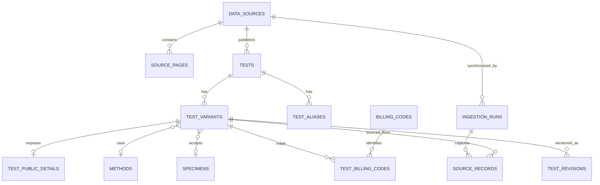

# SCL 공개 검사항목 RDB

## 목적

SCL 공개 검사항목 목록을 검색 가능한 관계형 데이터로 보존하고, 원문 출처·수집 시각·변경 이력을 잃지 않으면서 챗봇과 검색 API에 제공합니다. 내부 공식 검사 DB 연동이 아니라 공개 홈페이지 스냅샷입니다.

## 관계



`tests`는 검사코드 단위 마스터이고 `test_variants`는 원본 `itemcode:sampcode` 단위 행입니다. 같은 검사코드가 서로 다른 검체로 반복될 수 있으므로 변형을 합치지 않습니다.

`test_public_details`는 로그인 없이 볼 수 있는 각 검사 상세 페이지의 참고치, 채취방법 및 주의사항,
임상적 의의, 증감, 급여기준과 용기 안내를 원문 URL·내용 해시와 함께 저장합니다. 이 본문은 검사
자연어 검색과 챗봇 근거에 포함되며, 공개 페이지에 없는 내용은 보완하거나 추론하지 않습니다.

## 핵심 무결성 규칙

- `tests`: `(data_source_id, source_test_code)` 유일
- `test_variants`: `(test_id, source_sample_code)` 유일
- `source_records`: `(data_source_id, external_key, content_hash)` 유일
- 원본 행이 변경되면 기존 `source_records.is_current`를 내리고 새 revision을 만듭니다.
- 전체 수집 성공 시에만 미발견 횟수를 증가시킵니다.
- 기본 세 번 연속 미발견된 항목만 `inactive`로 전환합니다.
- 물리 삭제는 하지 않습니다.

## 수집 흐름

1. 첫 페이지에서 전체 페이지와 전체 행 수를 확인합니다.
2. 최대 50개씩 낮은 빈도로 전 페이지를 가져옵니다.
3. 한 페이지라도 실패하거나 전체 행 수가 다르면 운영 데이터를 변경하지 않습니다.
4. 전체 HTML을 모두 파싱한 뒤 한 트랜잭션에서 upsert합니다.
5. 동일 해시는 `last_seen_at`만 갱신합니다.
6. 값이 바뀌면 `source_records`와 `test_revisions`에 새 버전을 남깁니다.

## 실행

```powershell
$env:PYTHONPATH="backend"
.venv\Scripts\python scripts\crawl_scl_tests.py
.venv\Scripts\python scripts\sync_scl_test_details.py
```

기본 저장소는 `data/scl_catalog.db`이며 `DATABASE_URL`로 PostgreSQL을 사용할 수 있습니다.
