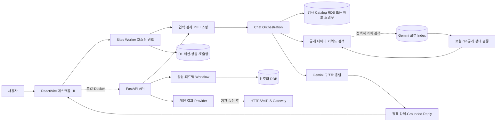

# 시스템 아키텍처

기준일: 2026-08-28

## 1. 설계 목표

이 시스템의 핵심 목표는 자연어 처리와 사실 조회를 분리하는 것이다. LLM은 질문을 구조화하고
검색 근거를 설명하지만 검사 코드, 용기, 일정, 공개문서와 출처의 존재 여부는 로컬 RDB가
결정한다.

## 2. 전체 구조

## 3. 요청 처리 순서

1. 프런트가 최대 500자의 질문과 세션 ID를 `POST /api/chat`으로 전송한다. 현재 공개 UI는
   `require_live=false`를 명시하며 엄격한 실시간 검증 호출만 `true`를 사용한다.
2. 서버가 입력 정규화, 개인정보 마스킹, 반복·욕설·Prompt Injection 정책을 적용한다.
3. 검사 Catalog 검색을 먼저 실행하고 그 후보를 공개 데이터 검색에 넘긴다. 두 검색은 논리적으로
   역할이 분리됐지만 FastAPI 구현에서는 순차 실행된다.
4. 키워드 검색은 항상 실행하며, 활성화된 경우 공개문서·첨부·게시 FAQ에만 의미 검색을 보강한다.
5. Vector 결과를 로컬 ref와 공개 원문 또는 배포 스냅샷에서 다시 확인한다.
6. Gemini GenerateContent가 구조화 응답 계약으로 답변 계획을 만든다.
7. 서버가 최초 검색 후보에서 검증된 참조만 재사용해 카드, 선택지, 출처와 정책 플래그를 구성한다.
8. 호스팅은 D1, FastAPI는 제한된 메모리 세션에 직전 검사 변형을 유지한다.

## 4. 검색 구조

| 검색 대상 | 저장소 | 검색 방식 | 최종 검증 |
|---|---|---|---|
| 검사명·코드·검체·용기·일정·소요일 | RDB | 구조화·키워드 | 검사/변형 키 |
| 공지·콘텐츠·의뢰서 | RDB | 키워드·본문 | 공개 상태·SCL URL |
| 문서·첨부·게시 FAQ 의미 검색 | Gemini 로컬 Index | 유사도 검색 | 로컬 ref·공개 상태 |
| 위치·메뉴·보존제·분류 | RDB | 구조화 검색 | 활성 레코드 |

모델이 벡터 저장소를 직접 호출하는 도구는 사용하지 않는다. Worker/FastAPI가
검색과 매핑 검증을 통제하고 검증된 스냅샷만 모델 입력에 포함한다.

## 5. 데이터 저장소

- 기본 개발 DB: `data/scl_catalog.db` SQLite
- 운영 대체 가능 DB: `DATABASE_URL`로 PostgreSQL 지정 가능
- Sites Worker 공개 검색: `SUPABASE_URL`과 `SUPABASE_PUBLISHABLE_KEY`가 있으면 Supabase HTTPS RPC를 사용하고, 연결 실패 시 배포 시점의 공개 스냅샷으로 전환
- 공개 원문·추출문: RDB와 로컬 첨부 디렉터리
- 상담 요청: Fernet 암호화 컬럼
- 채팅 세션: 호스팅 D1 또는 FastAPI 메모리, 브라우저 탭의 안전한 UI 상태만 `sessionStorage`
- Vector: 공개 문서 계열의 Gemini 로컬 인덱스

## 6. 배포 구조

공개 호스팅 빌드는 React 정적 자산과 Sites Worker, D1 binding을 묶는다. Docker Compose는
FastAPI 8000과 Nginx 기반 프런트 8080을 노출한다. 백엔드 이미지는 Python 3.13, Tesseract
한국어 모델과 LibreOffice를 포함하며 프런트 빌드는 Node 22를 사용한다.

## 7. 장애 동작

| 장애 | 동작 |
|---|---|
| 벡터 인덱스 미설정·타임아웃 | RDB 키워드 검색으로 복귀 |
| Gemini 호출 실패 + `require_live=true` | prepared 답변 없이 HTTP 503 |
| Gemini 호출 실패 + 공개 UI `require_live=false` | 검증된 검색 fallback, `mode=demo_fallback` |
| 결과 Gateway 미설정 | 인증 제출 시 명시적 실패, 비공식 결과 미노출 |
| 공개 참조 불일치 | 모델이 선택한 참조와 답변 폐기 |
| 첨부 추출 실패 | 상태를 분류해 저장하고 검증 스크립트에서 노출 |

## 8. 신뢰 경계

- 브라우저에는 Gemini 키, 결과 Gateway 비밀, 암호화 키를 넣지 않는다.
- LLM 출력은 데이터베이스 참조가 아니라 신뢰할 수 없는 제안으로 취급한다.
- 개인 결과 인증정보는 LLM provider와 로컬 DB에 저장하지 않는다.
- 공개 출처 링크는 SCL HTTPS 도메인만 허용한다.

상세 선택 근거는 [ADR](adr/README.md), 운영 절차는 [운영·인수인계](operations-and-handoff.md)를
참고한다.
